# sabiden ハイレベル設計 (HLD)

> NTT NGN 直収 SIP B2BUA + WebRTC ゲートウェイ (Rust 実装) のアーキテクチャ
> / レイヤ責務 / 主要シーケンス / 状態機械 / 不変条件を 1 ファイルに集約した
> 設計文書。実装の単一情報源 (single source of truth) として扱う。
>
> - 対象 commit: `f2b5f92` 系 (worktree) / 後続の本流修正 (P-CSCF 直書き / SDP 書換) を含む
> - 関連 docs:
>   [refactor-plan.md](./refactor-plan.md) (現状実装の責務分析 + リファクタ計画) /
>   [asterisk-real-invite.md](./asterisk-real-invite.md) (NGN 直収 INVITE 実機 pcap) /
>   [asterisk-ngn-invite-spec.md](./asterisk-ngn-invite-spec.md) (Asterisk ソース解析)
> - 関連 Issue: #46 (本ドキュメント) / #28 (str0m) / #29 (Opus 結線) / #15 (B2BUA 結線) / #37 (NGN 直収)

## Table of Contents

- [1. 概要 (Goal / Non-goal)](#1-概要-goal--non-goal)
- [2. 物理 / 論理デプロイ図](#2-物理--論理デプロイ図)
- [3. レイヤ責務マトリクス](#3-レイヤ責務マトリクス)
- [4. コンポーネント間データフロー](#4-コンポーネント間データフロー)
- [5. 状態機械 (State Machine)](#5-状態機械-state-machine)
- [6. 抽象モデル (Class Diagram)](#6-抽象モデル-class-diagram)
- [7. NGN 仕様まとめ](#7-ngn-仕様まとめ)
- [8. 不変条件 (B2BUA Invariants)](#8-不変条件-b2bua-invariants)
- [9. エラーハンドリング戦略](#9-エラーハンドリング戦略)
- [10. 観測性 (Observability)](#10-観測性-observability)
- [11. セキュリティ境界](#11-セキュリティ境界)
- [12. 拡張ポイント](#12-拡張ポイント)
- [13. 参考](#13-参考)
- [Appendix A. Assumption / Open Questions](#appendix-a-assumption--open-questions)

---

## 1. 概要 (Goal / Non-goal)

### 1.1 Goal

sabiden は **NTT 東日本 NGN (フレッツ光ネクスト IMS) に直接 REGISTER/INVITE
を喋る SIP B2BUA + WebRTC ゲートウェイ**で、以下を達成する:

1. **HGW (ホームゲートウェイ) を介さない NGN 直収**
   - 既設 HGW を一度起動して OSS-DB に WAN MAC を永続登録した後、
     その MAC を K8s NIC レベルで spoof し DHCPv4 (vendor class
     `RX-600KI`) で /30 IPv4 + Option 120 を取得 (init container 担当)。
   - sabiden は得た IP / SIP サーバを使って `Authorization` 無しで
     REGISTER → 回線認証ベースで `200 OK` を得る (Issue #37 で確認済)。
2. **B2BUA としての通話制御**
   - NGN レッグ (UAC for NGN P-CSCF) と内線レッグ (UAS for Linphone /
     Zoiper / WebRTC peer) を別 `TransactionLayer` で分離し、双方向に
     INVITE / BYE / CANCEL / Re-INVITE を仲介。
   - SIP メッセージは透過 forward ではなく **SBC (Session Border
     Controller, RFC 5853) 流儀の Topology Hiding** で再生成する。
   - SDP は B2BUA が NGN 側に向け書き換え、PCMU only / 自局 IP+port
     に正規化する (NGN は PCMU 以外の m= 形式を 488 で蹴るため必須)。
3. **WebRTC ゲートウェイ**
   - ブラウザ PWA (`frontend/`) からの WebSocket シグナリング上で
     SDP offer / answer / ICE candidate を交換。ICE / DTLS-SRTP / RTP
     を [str0m](https://github.com/algesten/str0m) で終端。
   - WebRTC レッグの Opus (48 kHz / stereo) と NGN レッグの G.711 μ-law
     (8 kHz / mono) を `TranscodingBridge` で双方向トランスコード。
4. **Cloudflare Edge デプロイ**
   - 自宅 sabiden を `cloudflared` Tunnel で Cloudflare に接続。
   - Worker (`workers/signaling-proxy.ts`) が `frontend/dist` の
     静的配信と `/signal` の WS パススルーを行い、上流 Tunnel を
     Cloudflare Access service token で保護する。
5. **K8s / systemd 配備可能なシングルバイナリ**
   - 設定は TOML + 環境変数 override (`SABIDEN_*`)。
   - `liveness=/healthz` / `readiness=/readyz` (REGISTER 後 200) /
     `/metrics` (Prometheus text exposition format) を提供。

### 1.2 Non-goal (本実装で扱わない)

- **完全な SIP プロキシ (RFC 3261 §16)**:
  sabiden は B2BUA であり Stateful Forwarding (Record-Route 自身書込み /
  via stack の rotate) は **行わない**。Via / Route の経路は dialog
  ローカルで確定する。
- **TLS / TCP トランスポート (RFC 3261 §18)**:
  NGN 直収は UDP 単独。`TransactionLayer` は UDP のみ実装。TLS が
  要件化された場合は別 backend として追加する。
- **Forking 受信応答** (1 INVITE → 複数 dialog):
  sabiden は B2BUA なので forking proxy にならない。受信 INVITE
  に対しては **内線レジストラの全 binding に並列 INVITE** する Asterisk
  風フォーク発信は行うが (`fork_to_extensions`)、SIP 的には B2BUA レッグ
  内の private fork で外部からは「1 通話」に見える。
- **着信履歴 / 音声録音 / DTMF / SMS**:
  Phase 4 以降の拡張ポイント (§12)。本 HLD では責務境界とフックだけ示す。
- **ICE-Full / TURN allocate**:
  WebRTC バックエンドは ICE-Lite (controlled) のみ。TURN URL は SDP に
  載せて配るが、sabiden 側で TURN allocate (Long-Term Credentials) は
  **行わない**。ブラウザ側で TURN を経由する。

### 1.3 設計原則

- **責務分離**: Transport / Transaction / Dialog / TU (UAC/UAS) /
  B2BUA Orchestrator / Bridge / WebRTC を別レイヤに保ち、層越境は
  trait 経由で限定する (現状逸脱は §3 / §6 で明記)。
- **band-aid 禁止**: 場当たり修正より **RFC + 実機 pcap** を根拠に
  本流実装する。NGN 仕様で逸脱せざるを得ない場合は実機 trace への
  リンクで根拠を残す ([asterisk-real-invite.md](./asterisk-real-invite.md))。
- **観測可能性**: SIP 全メッセージは `--trace-dir` でファイルダンプ可能。
  Authorization は redact。メトリクスは atomic counter で hot path 影響ゼロ。
- **テストファースト**: Phase R1 で `tests/common/` ハーネスを確立し、
  Mock NGN / Mock 内線 / `ScriptedInviter` の重複を排除する
  ([refactor-plan.md §3](./refactor-plan.md))。

---

## 2. 物理 / 論理デプロイ図

### 2.1 物理構成 (NGN 直収 + WebRTC PWA)

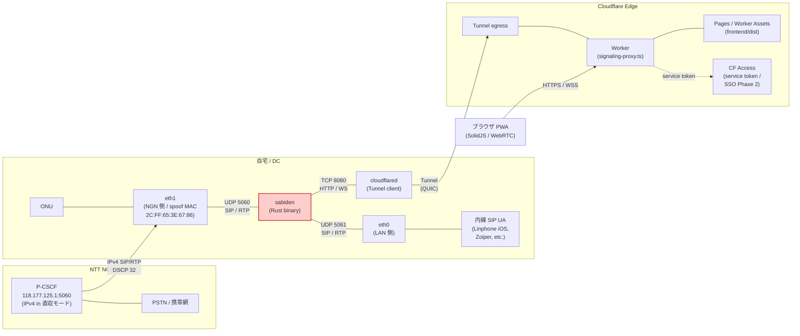
```mermaid
graph LR
  subgraph NTT["NTT NGN / IMS"]
    PCSCF["P-CSCF<br/>118.177.125.1:5060<br/>(IPv4 in 直収モード)"]
    PSTN["PSTN / 携帯網"]
    PCSCF --- PSTN
  end

  subgraph Home["自宅 / DC"]
    ONU[ONU]
    eth1["eth1<br/>(NGN 側 / spoof MAC<br/>2C:FF:65:3E:67:86)"]
    sabiden["sabiden<br/>(Rust binary)"]
    eth0["eth0<br/>(LAN 側)"]
    Linphone["内線 SIP UA<br/>(Linphone iOS,<br/>Zoiper, etc.)"]
    cfd["cloudflared<br/>(Tunnel client)"]

    ONU --- eth1
    eth1 -- "UDP 5060<br/>SIP / RTP" --- sabiden
    sabiden -- "UDP 5061<br/>SIP / RTP" --- eth0
    eth0 --- Linphone
    sabiden -- "TCP 8080<br/>HTTP / WS" --- cfd
  end

  subgraph CF["Cloudflare Edge"]
    Tunnel["Tunnel egress"]
    Worker["Worker<br/>(signaling-proxy.ts)"]
    Pages["Pages / Worker Assets<br/>(frontend/dist)"]
    Access["CF Access<br/>(service token /<br/> SSO Phase 2)"]
    Tunnel --- Worker
    Worker --- Pages
    Worker -. "service token" .-> Access
  end

  Browser["ブラウザ PWA<br/>(SolidJS / WebRTC)"]

  PCSCF -- "IPv4 SIP/RTP<br/>DSCP 32" --> eth1
  cfd -- "Tunnel<br/>(QUIC)" --> Tunnel
  Browser -- "HTTPS / WSS" --> Worker

  classDef sabidenBox fill:#fcc,stroke:#c33,stroke-width:2px;
  class sabiden sabidenBox;
```

#### ポイント

- **eth1 = NGN 側**: HGW WAN MAC `2C:FF:65:3E:67:86` を spoof 済み
  (project memory `project_hgw_mac.md`)。DHCPv4 で
  `118.177.72.242/30`、ゲートウェイ `118.177.72.241`、SIP サーバ
  `118.177.125.1` を取得 (memory `project_ngn_dhcp_result.md`)。
- **eth0 = LAN 側**: 内線 SIP UA (`uas.bind_addr = 0.0.0.0:5061`) を
  bind し、内線網と NGN 網は L4 で完全分離する。
- **DSCP 32 (TOS 0x80)**: NGN 側 SIP UDP socket と RTP socket 双方に
  `IPV6_TCLASS` / `IP_TOS` をセット (`main.rs::set_dscp`,
  `rtp::set_rtp_dscp`)。
- **Cloudflare Tunnel**: 自宅マシンから `cloudflared` で
  `https://signal.<domain>` を Cloudflare に接続。Worker が
  service token (`CF-Access-Client-Id` / `CF-Access-Client-Secret`)
  を上流に付与し、原則 PWA 以外からの直接アクセスをブロック。

### 2.2 論理構成 (sabiden 内部の bind / channel)

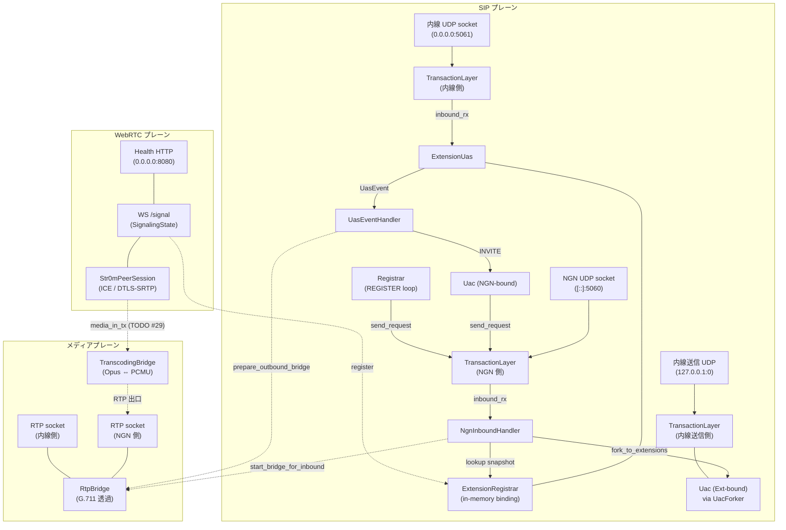
```mermaid
graph TB
  subgraph SipPlane["SIP プレーン"]
    NgnSocket["NGN UDP socket<br/>([::]:5060)"]
    NgnTxLayer["TransactionLayer<br/>(NGN 側)"]
    NgnUac["Uac (NGN-bound)"]
    Registrar["Registrar<br/>(REGISTER loop)"]
    NgnInbound["NgnInboundHandler"]

    ExtSocket["内線 UDP socket<br/>(0.0.0.0:5061)"]
    ExtTxLayer["TransactionLayer<br/>(内線側)"]
    ExtUas["ExtensionUas"]
    ExtRegistrar["ExtensionRegistrar<br/>(in-memory binding)"]
    UasHandler["UasEventHandler"]

    ExtSendSocket["内線送信 UDP<br/>(127.0.0.1:0)"]
    ExtSendTxLayer["TransactionLayer<br/>(内線送信側)"]
    ExtUac["Uac (Ext-bound)<br/>via UacForker"]

    NgnSocket --> NgnTxLayer
    NgnTxLayer -- "inbound_rx" --> NgnInbound
    NgnUac -- "send_request" --> NgnTxLayer
    Registrar -- "send_request" --> NgnTxLayer

    ExtSocket --> ExtTxLayer
    ExtTxLayer -- "inbound_rx" --> ExtUas
    ExtUas -- "UasEvent" --> UasHandler
    ExtUas --- ExtRegistrar
    NgnInbound -- "lookup snapshot" --> ExtRegistrar
    NgnInbound -- "fork_to_extensions" --> ExtUac
    UasHandler -- "INVITE" --> NgnUac

    ExtSendSocket --> ExtSendTxLayer
    ExtSendTxLayer --- ExtUac
  end

  subgraph MediaPlane["メディアプレーン"]
    BridgeSockNgn["RTP socket<br/>(NGN 側)"]
    BridgeSockExt["RTP socket<br/>(内線側)"]
    RtpBridge["RtpBridge<br/>(G.711 透過)"]
    Transcoder["TranscodingBridge<br/>(Opus ⇔ PCMU)"]
    BridgeSockNgn --- RtpBridge
    BridgeSockExt --- RtpBridge
  end

  subgraph WebRtcPlane["WebRTC プレーン"]
    Health["Health HTTP<br/>(0.0.0.0:8080)"]
    Signal["WS /signal<br/>(SignalingState)"]
    PeerSession["Str0mPeerSession<br/>(ICE / DTLS-SRTP)"]
    Health --- Signal
    Signal --- PeerSession
  end

  NgnInbound -. "start_bridge_for_inbound" .-> RtpBridge
  UasHandler -. "prepare_outbound_bridge" .-> RtpBridge
  PeerSession -. "media_in_tx (TODO #29)" .-> Transcoder
  Transcoder -. "RTP 出口" .-> BridgeSockNgn
  Signal -. "register" .-> ExtRegistrar
```

#### ポイント

- **3 つの UDP socket / 3 つの TransactionLayer**:
  1. NGN 側 listen (`[::]:5060` or DHCP で得た IPv4) — REGISTER /
     NGN 着信 INVITE / outbound INVITE 全部を相乗り。
  2. 内線 UAS listen (`0.0.0.0:5061`) — Linphone / Zoiper の REGISTER /
     INVITE 受信。
  3. 内線送信側 (`127.0.0.1:0` 動的) — sabiden が内線 UA に向けて
     INVITE を **発信** するときだけ使う (NGN 着信フォーク用)。
     現状 `127.0.0.1` 固定なので IPv6 内線環境では刺さる (§Appendix A.4)。
- **ExtensionRegistrar 共有**: NGN 着信ハンドラは `snapshot()` で
  全内線 binding を取り、`fork_to_extensions` で並列 INVITE を打つ。
  WebRTC peer 接続時は `signaling.rs` 経由で同 registrar に書き込まれる。
- **メディアプレーンと SIP プレーンの分離**: `RtpBridge` は
  `BridgeConfig::ngn_socket` / `ext_socket` を別に bind する。
  `RtpBridge::Drop` で abort される (Issue #15 の構成)。
- **B2BUA レジストリ (現状)**: `NgnInboundHandler::pending` /
  `active` と `UasEventHandler::active` の **2 種類のテーブル**で別々に
  管理しており、リファクタ Phase R4 で `B2buaRegistry` に集約予定
  ([refactor-plan.md §1.3](./refactor-plan.md))。

### 2.3 K8s デプロイ図 (参考)

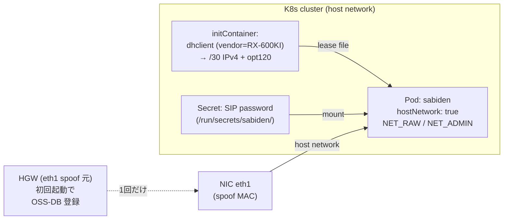
```mermaid
graph LR
  subgraph K8sCluster["K8s cluster (host network)"]
    InitContainer["initContainer:<br/>dhclient (vendor=RX-600KI)<br/>→ /30 IPv4 + opt120"]
    SabidenPod["Pod: sabiden<br/>hostNetwork: true<br/>NET_RAW / NET_ADMIN"]
    Secret["Secret: SIP password<br/>(/run/secrets/sabiden/)"]
    InitContainer -- "lease file" --> SabidenPod
    Secret -- "mount" --> SabidenPod
  end

  HGW["HGW (eth1 spoof 元)<br/>初回起動で<br/>OSS-DB 登録"]
  NIC["NIC eth1<br/>(spoof MAC)"]
  HGW -. 1回だけ .-> NIC
  NIC -- "host network" --> SabidenPod
```

`deploy/k8s/deployment.yaml` には initContainer + main container の構成と、
`hostNetwork: true` を必要最小権限で付ける指定が入っている。

---

## 3. レイヤ責務マトリクス

各 Rust モジュールの責務と RFC 引用、現状の逸脱・整理計画を 1 表にまとめる。
責務評価は [refactor-plan.md §1.1](./refactor-plan.md) の判定 (◎/▲/✗) を踏襲する。

| モジュール | 責務 (あるべき姿) | 主な RFC | 現状評価 | 現状の逸脱 / メモ |
|---|---|---|---|---|
| `src/sip/message.rs` | SIP メッセージ表現・パース・URI / ヘッダ正規化 | RFC 3261 §7, §19 | ▲ | `SipMethod::Other(String)` で IANA 未登録メソッドを表すが UAS で全て 405 化されている (`uas.rs:314`)。あるべき: `Notify/Subscribe/Publish/Update/Prack/Refer/Message` を enum に列挙 (Phase R2)。`parse_sip_uri` は §19.1 の subset (userinfo password / headers / `;user=phone` 等は別関数で扱う) |
| `src/sip/utils.rs` | branch / Call-ID / tag 生成 (16 行) | RFC 3261 §8.1.1.1, §8.1.1.7 | ◎ | 問題なし |
| `src/sip/addr.rs` | NGN 直収用 source IP 検出 (UDP `connect` トリック) | (実装独自) | ◎ | k8s で pod IP 動的化に対応する自動検出 (Issue #35) |
| `src/sip/auth.rs` | Digest 認証 (challenge / credential) | RFC 2617, RFC 7616 | ◎ | MD5 のみ。`auth-int` / SHA-256 / `stale=true` 未対応 |
| `src/sip/transaction.rs` | UAC/UAS トランザクション + Timer A/B/D/E/F/G/H/I/J/K/L | RFC 3261 §17, RFC 6026 §7.1 | ▲ | UAC 側 Timer A/B/D は実装。**Timer G/H/I (UAS), Timer J (non-INVITE UAS), Timer K (UAC), Timer L (RFC 6026)** は未実装。`server_tx_table` 不在 → **§17.2.3 の "match request to server tx"** に違反し、`pending` HashMap (Call-ID 単位) で代用 ([refactor-plan §1.6](./refactor-plan.md)) |
| `src/sip/dialog.rs` | UAC/UAS ダイアログ (Call-ID + tag triple), Route Set, in-dialog request 構築 | RFC 3261 §12, §13.2.2.4 (2xx ACK) | ◎ | `build_reinvite` / `build_ack_for_2xx` 実装済。**UAS 側 Re-INVITE 受信ハンドラは未実装** (`uas.rs::handle_invite` が dialog 既存判定をしない) |
| `src/sip/uac.rs` | INVITE / Re-INVITE / BYE / CANCEL の TU 駆動 | RFC 3261 §8 / §13, RFC 4028 | ▲ | INVITE は `TransactionLayer::send_request` (Timer B 1 本)。401/407 再認証経路なし。Allow ヘッダは Asterisk 互換改善余地 ([asterisk-ngn-invite-spec.md §4.4](./asterisk-ngn-invite-spec.md))。NGN 直収では PPI/Privacy なしで通った ([asterisk-real-invite.md §5.3](./asterisk-real-invite.md)) |
| `src/sip/uas.rs` | 内線 UAS: REGISTER 受付 / INVITE/BYE 受信 → 上位層イベント発行 | RFC 3261 §8.2, §10, §22 | ▲ | `_layer: Arc<TransactionLayer>` 保持だが server tx 登録なし。`SipMethod::Other` を全部 405 で返す (Notify は §3.2 by RFC 3265 で 481、PRACK は RFC 3262 で 481 が望ましい) |
| `src/sip/register.rs` | UAC 側 REGISTER + Session refresh | RFC 3261 §10, RFC 4028 (一部) | ◎ | NGN 直収 (`Authorization` 無し) を分岐。`static CSEQ` (line 23) はプロセス全体で 1 つ → 多回線対応時に衝突 (Phase R5 で struct field 化) |
| `src/sip/registrar.rs` | 内線 binding テーブル (AOR → contact_uri + remote + expires_at) | RFC 3261 §10.3 | ◎ | `register` と `register_with_transport` が API 二重化 (現 worktree では `register` のみ)。後段で WebRTC binding 統合時は trait object 化 (§3.5) |
| `src/sdp/parser.rs` | SDP パース | RFC 4566 §5 | ◎ | multicast `<addr>/<ttl>` 未対応。media-level `c=` の order 制約は緩い |
| `src/sdp/builder.rs` | SDP シリアライズ + Offer/Answer 補助 (`rewrite_rtp_endpoint`, `restrict_audio_to_pcmu`) | RFC 4566, RFC 3264 | ✗ | **`restrict_audio_to_pcmu` は §3 Offer/Answer 違反**。あるべき: `Negotiator` (Phase R3) で offer/answer ペアを再生成する (RFC 5853 §3.5 Topology Hiding) |
| `src/sdp/mod.rs` | SDP データ構造 (Origin / Connection / MediaDescription / Attribute) | RFC 4566 | ◎ | `Attribute::Property` / `Attribute::Value` 二択。構造化アクセサ (`as_fmtp` / `as_ptime`) は今後 |
| `src/rtp/packet.rs` | RTP ヘッダ / G.711 μ-law encode/decode (PT=0) | RFC 3550 §5, RFC 3551 §4.5.14 | ◎ | clean |
| `src/rtp/jitter.rs` | ジッタバッファ (4 frame depth, late drop) | RFC 3550 §6.4 | ◎ | clean |
| `src/rtp/session.rs` | RtpSession (seq / ts / SSRC 管理) | RFC 3550 §5 | ◎ | clean |
| `src/rtp/rtcp.rs` | RTCP SR/RR (受信統計 / 送信統計) | RFC 3550 §6 | ◎ | clean |
| `src/rtp/codec/opus.rs` | Opus エンコーダ / デコーダ FFI ラッパ | RFC 6716, RFC 7587 | ◎ | `libopus` 必須 |
| `src/rtp/codec/resample.rs` | rubato 経由の 8 kHz ↔ 48 kHz サンプリング変換 | (実装独自) | ◎ | clean |
| `src/call/orchestrator.rs` | NGN ⇔ 内線 B2BUA orchestration (NgnInboundHandler / UasEventHandler) | RFC 5853, RFC 3261 §13/§15 | ✗ | 現 worktree 1657 行 / main 3188 行と巨大。`pending` / `active` / `by_ext` 4 表に分散。あるべき: `B2buaCall` 単一構造体 + `B2buaRegistry` (Phase R4) |
| `src/call/manager.rs` | フォーク INVITE (`fork_to_extensions`) + 通話状態テーブル + `UacForker` | (B2BUA 内部) | ▲ | `fork_to_extensions` (SIP only) と orchestrator 内の `fork_to_bindings` (transport-aware) が並存予定 (Phase R6 で統合) |
| `src/call/bridge.rs` | RTP リレー (G.711 透過) — late-binding peer learning | RFC 3550 (transparent relay) | ◎ | 設計クリーン |
| `src/call/transcoder.rs` | Opus ↔ G.711 トランスコード: `TranscodingBridge` (内線 UDP) + `WebRtcAudioBridge` (peer MediaFrame mpsc, Issue #87/#121) の 2 種 | RFC 6716, RFC 3551, RFC 7587 | ◎ | bridge と並列にあるが responsibilities は分離。 NGN→PWA 着信は `WebRtcAudioBridge`、 NGN↔SIP 内線 (Linphone Opus 等) は `TranscodingBridge`、 両側 PCMU は `RtpBridge` |
| `src/webrtc/auth.rs` | HMAC-SHA256 トークン検証 (`AuthClaims`) | (実装独自 / Cloudflare 連携) | ◎ | constant-time 比較 |
| `src/webrtc/signaling.rs` | WS シグナリング (`/signal`): register / offer / answer / ice / bye + サーバ → ブラウザ keepalive Ping (RFC 6455 §5.5.2, 既定 30s 周期 / 60s idle close, Issue #98) | (アプリ独自 JSON) | ◎ | `process_client_message` 分離テスト容易性あり、 keepalive ループは `KeepaliveSender` trait + `run_keepalive_loop` で fake 注入できる構造 |
| `src/webrtc/peer.rs` | `PeerSession` trait + stub。 [`MediaFrame`] I/O (`take_media_rx` / `send_media`) を含む (Issue #87) | (抽象) | ◎ | trait 設計良い |
| `src/webrtc/str0m_session.rs` | str0m バックエンド (Sans-IO + tokio run-loop)。 `Event::MediaData` を `media_in_tx` で MediaFrame mpsc に流し、 `Rtc::writer(mid).write` で送出する (Issue #87) | RFC 5245 (ICE), RFC 8445, RFC 5763/5764 (DTLS-SRTP), RFC 7587 (Opus) | ◎ | ICE-Lite + メディア結線完了。 IPv6 public_ip 未対応 |
| `src/observability/mod.rs` | メトリクス + SIP トレース dump (`Authorization` redact) | (Prometheus text) | ◎ | 自前 atomic counter |
| `src/health/mod.rs` | `/healthz` `/readyz` `/metrics` `/signal` 同居 axum HTTP | (K8s probe spec) | ◎ | clean |
| `src/config/mod.rs` | TOML + 環境変数 override + NGN 直収モード分岐 | (アプリ独自) | ◎ | NGN 直収モード (`[ngn] direct_mode = true`) で `Authorization` 強制 off |
| `src/dhcp/mod.rs` | DHCP Option 120 (RFC 3361) 取得ヘルパ (env / lease ファイル) | RFC 3361 | ◎ | dhclient hook 経由で `new_ip_sip_servers` 環境変数 |

凡例: ◎ = 概ね責務適切、▲ = 改善余地あり、✗ = 責務逸脱・大規模リファクタ必要。

### 3.1 RFC 3261 カバレッジ抜粋

主要セクションのカバレッジ (詳細は
[refactor-plan.md §2](./refactor-plan.md)):

| Section | 内容 | 状態 |
|---|---|---|
| §7 | Requests / Responses / Headers / Bodies | ✓ (compact 展開, body 抽出) |
| §8.1.1 | URI / From / To / Call-ID / CSeq / Max-Forwards / Via / Contact / Allow / Supported | ✓ |
| §8.1.3 | Processing Responses | △ (3xx redirect なし) |
| §8.2 | UAS Behavior | △ (merged request 検出 §8.2.2.2 なし) |
| §10 | REGISTER (UAC + UAS) | ✓ |
| §12 | Dialogs (Early/Confirmed/Terminated) | ✓ |
| §13 | Initiating a Session | △ (3xx/4xx 401/407/422 経路なし) |
| §15 | Terminating a Session | ✓ (BYE) |
| §17.1 | Client Tx (INVITE/non-INVITE) | △ (Timer K 未実装) |
| §17.2 | Server Tx | ✗ (Timer G/H/I/J/L 未実装、server_tx_table なし) |
| §17.2.3 | Matching Requests to Server Tx | ✗ (Call-ID 単位代用) |
| §22 | Authentication | △ (Digest MD5 のみ) |

関連 RFC:

| RFC | 状態 | メモ |
|-----|---|---|
| RFC 3261 (SIP) | △ | 上記詳細 |
| RFC 3262 (PRACK / 100rel) | ✗ | NGN 通常運用では不要だが将来必要 |
| RFC 3264 (SDP O/A) | △ | `Negotiator` 不在 (Phase R3) |
| RFC 3265 (SUBSCRIBE/NOTIFY) | ✗ | Linphone presence で来るが 405 化 |
| RFC 3311 (UPDATE) | ✗ | 405 化 (uas.rs) |
| RFC 3325 (PAI / PPI) | △ | `c9e3563` で削除、Asterisk pcap で不要確認 |
| RFC 3361 (DHCP Option 120) | ✓ | env / lease 両対応 |
| RFC 3550 / 3551 (RTP / Profile) | ✓ | rtp/ |
| RFC 3581 (rport) | △ | `c9e3563` で `;rport` 付与に変更 |
| RFC 4028 (Session Timer) | △ | UAC build_reinvite に `Session-Expires: 300;refresher=uac` 設定済。**422 自動再交渉なし**。**Refresher 送信タイマ駆動なし** |
| RFC 4566 (SDP) | ✓ | sdp/ |
| RFC 5245 / 8445 (ICE) | △ | ICE-Lite (str0m 0.19) |
| RFC 5853 (SBC) | △ | B2BUA + SDP 翻訳を **暗黙に** 実装 |
| RFC 6026 (Timer L) | ✗ | 2xx ACK 後の Confirmed/Accepted state 未維持 |
| RFC 6716 / 7587 (Opus / Opus RTP) | ✓ | `rtp::codec::opus` |
| RFC 7616 (Digest SHA-256) | ✗ | MD5 only |
| RFC 8835 (WebRTC Reqs) | △ | str0m 経由 |

### 3.2 層越境 (Layer Violation) 警告

現状コードで上位層が下位層を越えて参照している箇所:

1. `src/sip/registrar.rs` が `crate::webrtc::peer::PeerSession` /
   `crate::webrtc::signaling::{PendingAnswers, WsSink}` を直接 import
   (現 worktree より進んだ main で発生)。**SIP レイヤが WebRTC レイヤに
   依存してはならない**。あるべきは `Box<dyn ExtCallTarget>` のような
   trait object 越し (Phase R6)。
2. `src/call/orchestrator.rs::run_webrtc_leg` で SIP Via に
   `SIP/2.0/WS webrtc.peer` という嘘の値を入れて偽の `SipResponse` を
   組み立てている (main 1549-1561)。`LegOutcome` に SDP body だけ詰めて
   返すのが正しい。

これらは Phase R6 (`refactor-plan §5.6`) で解消する。

### 3.3 モジュール依存ツリー (あるべき姿)

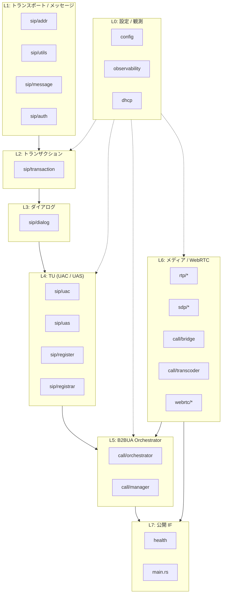
```mermaid
graph TD
  subgraph L0["L0: 設定 / 観測"]
    config[config]
    observability[observability]
    dhcp[dhcp]
  end
  subgraph L1["L1: トランスポート / メッセージ"]
    addr[sip/addr]
    utils[sip/utils]
    message[sip/message]
    auth[sip/auth]
  end
  subgraph L2["L2: トランザクション"]
    transaction[sip/transaction]
  end
  subgraph L3["L3: ダイアログ"]
    dialog[sip/dialog]
  end
  subgraph L4["L4: TU (UAC / UAS)"]
    uac[sip/uac]
    uas[sip/uas]
    register[sip/register]
    registrar[sip/registrar]
  end
  subgraph L5["L5: B2BUA Orchestrator"]
    orchestrator[call/orchestrator]
    manager[call/manager]
  end
  subgraph L6["L6: メディア / WebRTC"]
    rtp[rtp/*]
    sdp[sdp/*]
    bridge[call/bridge]
    transcoder[call/transcoder]
    webrtc[webrtc/*]
  end
  subgraph L7["L7: 公開 IF"]
    health[health]
    main[main.rs]
  end

  L1 --> L2
  L2 --> L3
  L3 --> L4
  L4 --> L5
  L6 --> L5
  L0 -.-> L2
  L0 -.-> L4
  L0 -.-> L5
  L0 -.-> L6
  L5 --> L7
  L6 --> L7
```

**禁止リレーション**: `L4 → L6` の戻り依存 (registrar → webrtc)、
`L4 → L5`、`L1〜L3 → L4`。リファクタ後はすべて trait 経由 / mpsc 経由
で依存方向を一方向に保つ。

---

## 4. コンポーネント間データフロー

主要 4 シーケンスを Mermaid で示す。各シーケンスは「成功パス +
代表的失敗パス」を 1 図にまとめる。

### 4.1 内線 → NGN 発信 (Outbound)

内線 (Linphone) から `117` (NGN 時報) へ発信する成功パス。
`UasEventHandler::handle_event` が NGN レッグに INVITE を proxy し、
両側 200 OK / ACK 完了で RTP ブリッジを起動する。

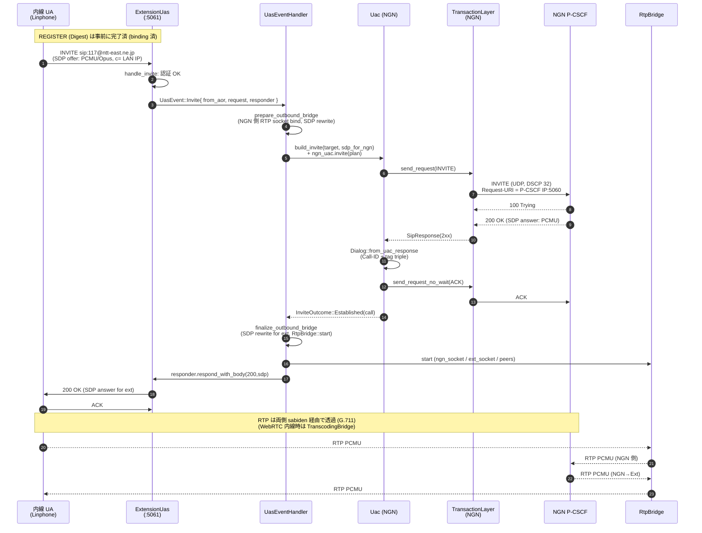
```mermaid
sequenceDiagram
  autonumber
  participant Ext as 内線 UA<br/>(Linphone)
  participant ExtUas as ExtensionUas<br/>(:5061)
  participant UasH as UasEventHandler
  participant NgnUac as Uac (NGN)
  participant NgnTx as TransactionLayer<br/>(NGN)
  participant Pcscf as NGN P-CSCF
  participant Bridge as RtpBridge

  Note over Ext,ExtUas: REGISTER (Digest) は事前に完了済 (binding 済)
  Ext->>ExtUas: INVITE sip:117@ntt-east.ne.jp<br/>(SDP offer: PCMU/Opus, c= LAN IP)
  ExtUas->>ExtUas: handle_invite: 認証 OK
  ExtUas->>UasH: UasEvent::Invite{ from_aor, request, responder }
  UasH->>UasH: prepare_outbound_bridge<br/>(NGN 側 RTP socket bind, SDP rewrite)
  UasH->>NgnUac: build_invite(target, sdp_for_ngn)<br/>+ ngn_uac.invite(plan)
  NgnUac->>NgnTx: send_request(INVITE)
  NgnTx->>Pcscf: INVITE (UDP, DSCP 32)<br/>Request-URI = P-CSCF IP:5060
  Pcscf-->>NgnTx: 100 Trying
  Pcscf-->>NgnTx: 200 OK (SDP answer: PCMU)
  NgnTx-->>NgnUac: SipResponse(2xx)
  NgnUac->>NgnUac: Dialog::from_uac_response<br/>(Call-ID + tag triple)
  NgnUac->>NgnTx: send_request_no_wait(ACK)
  NgnTx->>Pcscf: ACK
  NgnUac-->>UasH: InviteOutcome::Established(call)
  UasH->>UasH: finalize_outbound_bridge<br/>(SDP rewrite for ext, RtpBridge::start)
  UasH->>Bridge: start (ngn_socket / ext_socket / peers)
  UasH->>ExtUas: responder.respond_with_body(200,sdp)
  ExtUas->>Ext: 200 OK (SDP answer for ext)
  Ext->>ExtUas: ACK
  Note over Ext,Pcscf: RTP は両側 sabiden 経由で透過 (G.711)<br/>(WebRTC 内線時は TranscodingBridge)
  Ext-->>Bridge: RTP PCMU
  Bridge-->>Pcscf: RTP PCMU (NGN 側)
  Pcscf-->>Bridge: RTP PCMU (NGN→Ext)
  Bridge-->>Ext: RTP PCMU
```

#### 失敗パスの分岐

- **NGN 側 401/407**: `Uac::invite` は `InviteOutcome::Failed` を返し、
  UasEventHandler は `responder.quick(<status>, ...)` で内線へ転送
  (`uac.rs:185`)。**現状は再認証経路なし** (Phase R5 で 401 リトライ追加予定)。
- **NGN 側 408 / トランスポートエラー**: `NgnTx::send_request` が `Err`
  → `responder.quick(503, "Service Unavailable")` (`orchestrator.rs:670`)。
- **NGN 側 488 (Not Acceptable Here)**: SDP に PCMU 以外を残したまま送る
  と発生。`prepare_outbound_bridge` で `Negotiator::for_ngn` (Phase R3) に
  通すべき。現状は `restrict_audio_to_pcmu` を呼ぶ (
  [refactor-plan §1.4](./refactor-plan.md))。

### 4.2 NGN → 内線 着信 (Inbound, Asterisk 風フォーク)

NGN P-CSCF からの INVITE を `NgnInboundHandler` が受け、
`ExtensionRegistrar::snapshot()` の全内線に並列 INVITE。
最初に `200 OK` を返した内線で確立、他レッグへ CANCEL を撃つ。

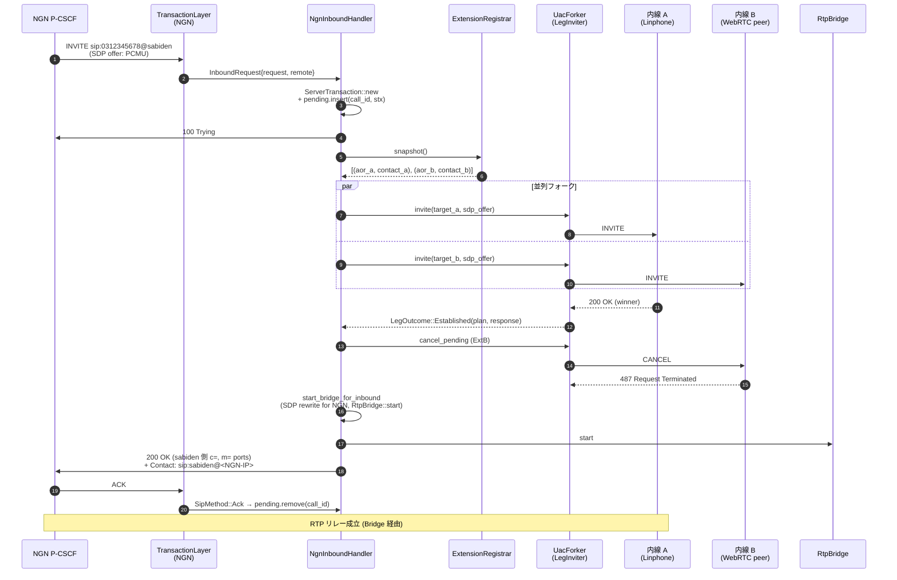
```mermaid
sequenceDiagram
  autonumber
  participant Pcscf as NGN P-CSCF
  participant NgnTx as TransactionLayer<br/>(NGN)
  participant NgnInb as NgnInboundHandler
  participant ExtReg as ExtensionRegistrar
  participant Forker as UacForker<br/>(LegInviter)
  participant ExtA as 内線 A<br/>(Linphone)
  participant ExtB as 内線 B<br/>(WebRTC peer)
  participant Bridge as RtpBridge

  Pcscf->>NgnTx: INVITE sip:0312345678@sabiden<br/>(SDP offer: PCMU)
  NgnTx->>NgnInb: InboundRequest{request, remote}
  NgnInb->>NgnInb: ServerTransaction::new<br/>+ pending.insert(call_id, stx)
  NgnInb->>Pcscf: 100 Trying
  NgnInb->>ExtReg: snapshot()
  ExtReg-->>NgnInb: [(aor_a, contact_a), (aor_b, contact_b)]
  par 並列フォーク
    NgnInb->>Forker: invite(target_a, sdp_offer)
    Forker->>ExtA: INVITE
  and
    NgnInb->>Forker: invite(target_b, sdp_offer)
    Forker->>ExtB: INVITE
  end
  ExtA-->>Forker: 200 OK (winner)
  Forker-->>NgnInb: LegOutcome::Established(plan, response)
  NgnInb->>Forker: cancel_pending (ExtB)
  Forker->>ExtB: CANCEL
  ExtB-->>Forker: 487 Request Terminated
  NgnInb->>NgnInb: start_bridge_for_inbound<br/>(SDP rewrite for NGN, RtpBridge::start)
  NgnInb->>Bridge: start
  NgnInb->>Pcscf: 200 OK (sabiden 側 c=, m= ports)<br/>+ Contact: sip:sabiden@<NGN-IP>
  Pcscf->>NgnTx: ACK
  NgnTx->>NgnInb: SipMethod::Ack → pending.remove(call_id)
  Note over Pcscf,ExtA: RTP リレー成立 (Bridge 経由)
```

#### 重要ポイント

- **ServerTransaction の保持**: `pending: HashMap<call_id, Arc<Mutex<ServerTransaction>>>`
  に保存し、ACK / BYE 受信時に同じ tx に参照する。**§17.2.3 違反**: 本来は
  TransactionId (branch + sent-by + method) でテーブル化すべき (Phase R5)。
- **SDP 書き換え**: NGN へ返す `200 OK` の SDP は
  内線レッグの answer body をベースに `rewrite_rtp_endpoint` で
  sabiden の NGN 側 RTP socket を指すように書き換える
  (`orchestrator.rs:411-413`)。失敗時は SDP 透過モード (`response.body` をそのまま返す)。
- **CANCEL の race**: `Forker::cancel_pending` は完了済み LegOutcome::Established
  以外のレッグへ送るが、200 OK 直後 / CANCEL 受信のタイミング次第で
  両方 200 を返した内線で glare race が起きうる。`refactor-plan §1.3 #3` で
  `cancelled_flag` AtomicBool 保護策を提案 (現状はテストカバレッジ不十分)。
- **登録内線ゼロの場合**: `ForkResult::AllFailed` 経由で **480 Temporarily
  Unavailable** を NGN へ返す (`orchestrator.rs:261`)。

### 4.3 WebRTC peer 着信 (NGN INVITE → ブラウザ)

WebRTC peer がブラウザから WS で `register` 済みの状態で、NGN から着信が
来た場合のフロー。

**メディア結線完了**: Issue #87 / #91 / #121 で str0m の `Event::MediaData`
取り出しと `Rtc::writer(mid).write` 経由の送出、 NGN UDP socket と peer の
MediaFrame mpsc を Opus⇔PCMU トランスコーダで橋渡しする
[`MediaBridge::WebRtcAudio`](../src/call/transcoder.rs) を結線済み。

Issue #73 で sabiden 自身が **offerer** に切り替わった (NGN 由来生 SDP は
ブラウザが DTLS-SRTP / ICE 認証情報不在で拒絶するため、`peer.create_offer()`
で SAVPF/PCMU オファを生成して push する。RFC 8827 §6.5, RFC 8839 §4.1)。

Issue #91: PWA 側は `pendingIceCandidates` バッファを持ち、 `call` 生成前に
届いた ICE candidate を蓄積し、 `acceptIncomingOffer` / `placeCall` 直後に
flush する (RFC 8445 §6.1.2.1, RFC 8839 §4 trickle ICE: remote description /
PeerConnection 確立前の candidate は受信側で buffer すべき)。

```mermaid
sequenceDiagram
  autonumber
  participant Browser as ブラウザ PWA
  participant Worker as CF Worker<br/>(/signal)
  participant Sig as SignalingState<br/>(/signal)
  participant ExtReg as ExtensionRegistrar
  participant NgnInb as NgnInboundHandler
  participant Pcscf as NGN P-CSCF
  participant Peer as Str0mPeerSession
  participant Trans as TranscodingBridge

  Browser->>Worker: WSS /signal?token=<HMAC>
  Worker->>Worker: CF Access service token を上流に付加
  Worker->>Sig: WS upgrade (with Authorization)
  Sig->>Sig: Verifier::verify(token) → AuthClaims
  Browser->>Sig: { type: register, ext_id }
  Sig->>ExtReg: register(ext_id, contact=webrtc.peer, remote=ws-peer)
  Sig->>Browser: { type: registered, ext_id }
  Note over Browser,Sig: WebRTC peer 着信待ち
  loop keepalive (RFC 6455 §5.5.2 / Issue #98)
    Sig-->>Browser: WS Ping (interval=30s, 既定)
    Browser-->>Sig: WS Pong (auto by browser per RFC 6455 §5.5.3)
    Note over Sig: Pong が idle_timeout=60s 以内に来なければ<br/>Close (1011) を送って撤収<br/>(Cloudflare Tunnel idle 100s 切断対策)
  end

  Pcscf->>NgnInb: INVITE (NGN SDP: RTP/AVP PCMU)
  NgnInb->>ExtReg: snapshot() → [..., (ext_id, webrtc.peer)]
  NgnInb->>Sig: fork_to_bindings: dispatch WebRTC leg
  Sig->>Peer: peer.create_offer()<br/>(sabiden が offerer; SAVPF/PCMU + DTLS fingerprint + ICE)
  Peer-->>Sig: SAVPF/PCMU SDP オファ
  Sig-->>Browser: { type: offer, sdp: savpf_offer }
  Browser->>Browser: setRemoteDescription + createAnswer
  Browser-->>Sig: { type: answer, sdp: savpf_answer }
  Sig->>Peer: peer.accept_answer(savpf_answer)
  par ICE candidate 交換 (trickle)
    Peer-->>Sig: local cand
    Sig-->>Browser: { type: ice, candidate }
    Browser-->>Sig: { type: ice, candidate }
    Sig->>Peer: add_ice_candidate
  end
  Note over Browser,Peer: ICE / DTLS-SRTP 確立
  Sig-->>NgnInb: LegResult::Established (body = convert_savpf_to_avp(savpf_answer))
  NgnInb->>NgnInb: start_bridge_for_inbound:<br/>rewrite c=/m= port → sabiden NGN socket
  NgnInb->>Pcscf: 200 OK (sabiden の RTP socket を指す SDP)
  Pcscf->>NgnInb: ACK

  Note over Pcscf,Browser: メディア結線 (Issue #87 / #121 で結線済)
  Note over NgnInb,Peer: start_bridge_for_inbound が WebRtcLegArtifacts を<br/>受けて MediaBridge::WebRtcAudio を起動
  Pcscf-->>NgnInb: RTP PCMU (NGN UDP socket)
  NgnInb->>Trans: μ-law decode → 8k PCM → upsample 48k → Opus encode
  Trans->>Peer: peer.send_media(MediaFrame{pt=opus,rtp_time,payload})
  Peer-->>Browser: SRTP Opus (str0m Rtc::writer(mid).write)
  Browser-->>Peer: SRTP Opus
  Peer-->>Trans: Event::MediaData → media_in_tx → MediaFrame
  Trans-->>NgnInb: Opus decode → 48k PCM → downsample 8k → μ-law encode
  NgnInb-->>Pcscf: RTP PCMU (NGN UDP socket)
```

> なお `start_bridge_for_inbound` が起動できなかった場合、 WebRTC leg の
> 200 OK SDP body は `c=IN IP4 0.0.0.0` / `m=audio 9` のままなので、
> `NgnInboundHandler::handle_invite` は **502 Bad Gateway** を返して呼を
> 放棄する (Issue #73 review)。 transparent モード (`call_manager == None`,
> Issue #15 互換) でも、 `is_unrewritten_webrtc_sdp` が `0.0.0.0:9` を
> 検知したら 502 に切り替える。 SIP leg のみの transparent 動作は従来どおり。

#### 現状実装と「あるべき」のギャップ

| 項目 | 現状 | あるべき (Phase R6) |
|---|---|---|
| `Event::MediaData` の扱い | **Issue #87 で解消済**: `media_in_tx: mpsc::Sender<MediaFrame>` 経由で `WebRtcAudioBridge` (= `TranscodingBridge` の peer 版) に流す | (現状で完成) |
| NGN SDP → browser SDP 変換 | Issue #73 で `peer.create_offer()` 経由に切替済 (SAVPF/PCMU オファを sabiden 側生成、DTLS fingerprint / ICE 認証情報込み)。Negotiator API (RFC 3264 統合) は別 Issue (Phase R3) | `Negotiator::for_webrtc()` で NGN ⇔ browser のコーデック折衝を Opus 含めて一元化 |
| WebRTC peer ↔ RtpBridge 結線 | **Issue #121 で解消済**: `MediaBridge::WebRtcAudio` を新設し、 内線側 UDP socket を bind せず `peer.send_media` / `peer.take_media_rx` の MediaFrame mpsc で双方向結線。 NGN UDP socket とは Opus⇔PCMU トランスコードで橋渡し | (現状で完成) |
| ICE candidate pre-buffer | **Issue #91 で解消済**: PWA `App.tsx` が `call` 生成前に届いた `ServerMessage::Ice` を `pendingIceCandidates: string[]` に蓄積、 `acceptIncomingOffer` / `placeCall` 直後に `flushPendingIce()` で順次 `addIce` する (RFC 8445 §6.1.2.1) | (現状で完成) |
| ICE failure 通知 | `local_cand_rx` が drop されたら run_loop 終了するだけ | `B2buaCall` に通知 → NGN レッグで CANCEL 発射 |
| `ExtTransport::WebRtc` の bind 構造 | `registrar.rs` が `webrtc::peer::PeerSession` を直接 import (層越境) | `ExtCallTarget` trait 経由 |

### 4.4 早期切断 / CANCEL / 競合 BYE

#### 4.4a 内線→NGN 発信中の CANCEL (内線が先に切る)

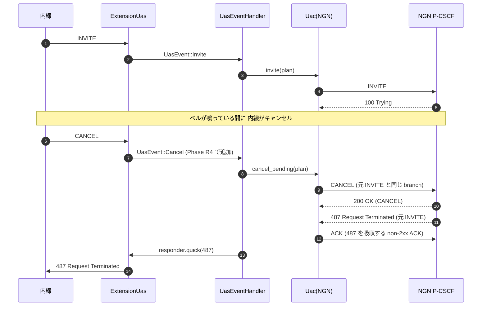
```mermaid
sequenceDiagram
  autonumber
  participant Ext as 内線
  participant ExtUas as ExtensionUas
  participant UasH as UasEventHandler
  participant NgnUac as Uac(NGN)
  participant Pcscf as NGN P-CSCF

  Ext->>ExtUas: INVITE
  ExtUas->>UasH: UasEvent::Invite
  UasH->>NgnUac: invite(plan)
  NgnUac->>Pcscf: INVITE
  Pcscf-->>NgnUac: 100 Trying
  Note over Ext,Pcscf: ベルが鳴っている間に 内線がキャンセル
  Ext->>ExtUas: CANCEL
  ExtUas->>UasH: UasEvent::Cancel (Phase R4 で追加)
  UasH->>NgnUac: cancel_pending(plan)
  NgnUac->>Pcscf: CANCEL (元 INVITE と同じ branch)
  Pcscf-->>NgnUac: 200 OK (CANCEL)
  Pcscf-->>NgnUac: 487 Request Terminated (元 INVITE)
  NgnUac->>Pcscf: ACK (487 を吸収する non-2xx ACK)
  UasH->>ExtUas: responder.quick(487)
  ExtUas->>Ext: 487 Request Terminated
```

ポイント:
- **CANCEL の branch / Call-ID / CSeq number は元 INVITE と同一** (RFC 3261 §9.1)。`utils::new_branch` を使わず INVITE の Via をコピー (`uac::build_cancel`)。
- **non-2xx ACK は automatic** (RFC 3261 §17.1.1.3): `transaction.rs::build_non2xx_ack` が `Completed` 遷移時に吸収する (commit `03e4564`)。

#### 4.4b CANCEL と 200 OK の glare race

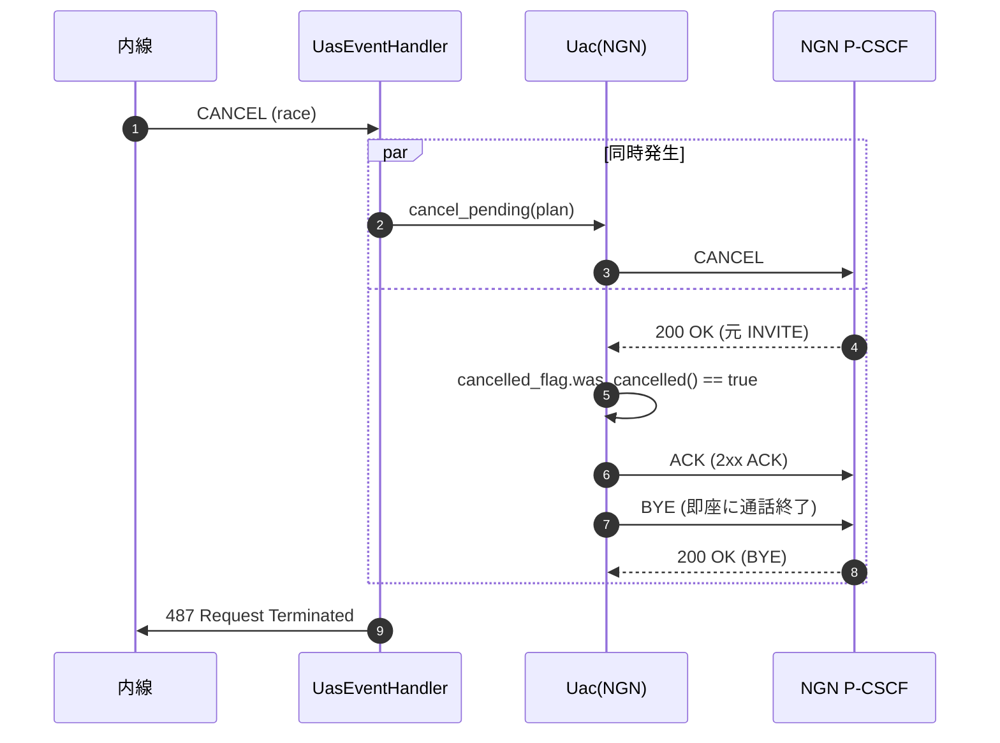
```mermaid
sequenceDiagram
  autonumber
  participant Ext as 内線
  participant UasH as UasEventHandler
  participant NgnUac as Uac(NGN)
  participant Pcscf as NGN P-CSCF

  Ext->>UasH: CANCEL (race)
  par 同時発生
    UasH->>NgnUac: cancel_pending(plan)
    NgnUac->>Pcscf: CANCEL
  and
    Pcscf-->>NgnUac: 200 OK (元 INVITE)
    NgnUac->>NgnUac: cancelled_flag.was_cancelled() == true
    NgnUac->>Pcscf: ACK (2xx ACK)
    NgnUac->>Pcscf: BYE (即座に通話終了)
    Pcscf-->>NgnUac: 200 OK (BYE)
  end
  UasH->>Ext: 487 Request Terminated
```

ポイント (現状): `cancelled_flag: AtomicBool` で「CANCEL 送信済み」を立て、
`Uac::invite` の最終応答が 2xx なら **直後に NGN BYE を送る** (RFC 3261 §15.1.1)。
**あるべき**: `B2buaCall::cancel_state` を `enum CancelState { None, Cancelled, GlareWith2xx }`
にし、glare 検出を構造化する (Phase R4)。

#### 4.4c 競合 BYE (両側同時 BYE)

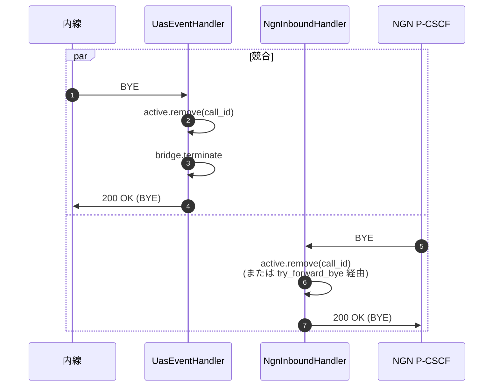
```mermaid
sequenceDiagram
  autonumber
  participant Ext as 内線
  participant UasH as UasEventHandler
  participant NgnInb as NgnInboundHandler
  participant Pcscf as NGN P-CSCF

  par 競合
    Ext->>UasH: BYE
    UasH->>UasH: active.remove(call_id)
    UasH->>UasH: bridge.terminate
    UasH->>Ext: 200 OK (BYE)
  and
    Pcscf->>NgnInb: BYE
    NgnInb->>NgnInb: active.remove(call_id)<br/>(または try_forward_bye 経由)
    NgnInb->>Pcscf: 200 OK (BYE)
  end
```

ポイント:
- **どちらが先に来ても通話は終了** で、内側ブリッジは 1 度しか stop されない
  (`HashMap::remove` の 2 回目は `None` を返すので idempotent)。
- **現状の問題**: 「内線→NGN BYE を NGN へ伝搬する」処理が `UasEventHandler::handle_event`
  の `UasEvent::Bye` 分岐に **存在しない** (`orchestrator.rs:679-695`)。
  あるべきは `ngn_dialog.send_bye()` を発射すること (Phase R4 の `B2buaCall::handle_ext_bye`)。

### 4.5 REGISTER (NGN 直収モード, 認証なし)

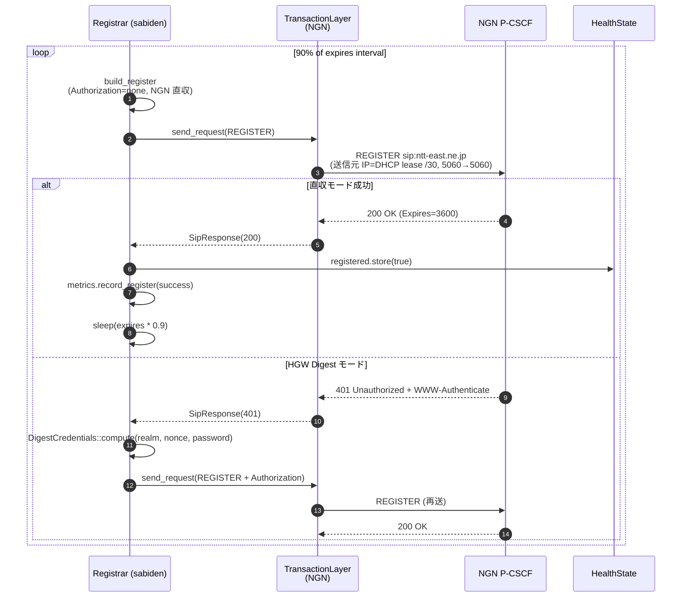
```mermaid
sequenceDiagram
  autonumber
  participant Sabiden as Registrar (sabiden)
  participant NgnTx as TransactionLayer<br/>(NGN)
  participant Pcscf as NGN P-CSCF
  participant Health as HealthState

  loop 90% of expires interval
    Sabiden->>Sabiden: build_register<br/>(Authorization=none, NGN 直収)
    Sabiden->>NgnTx: send_request(REGISTER)
    NgnTx->>Pcscf: REGISTER sip:ntt-east.ne.jp<br/>(送信元 IP=DHCP lease /30, 5060→5060)
    alt 直収モード成功
      Pcscf-->>NgnTx: 200 OK (Expires=3600)
      NgnTx-->>Sabiden: SipResponse(200)
      Sabiden->>Health: registered.store(true)
      Sabiden->>Sabiden: metrics.record_register(success)
      Sabiden->>Sabiden: sleep(expires * 0.9)
    else HGW Digest モード
      Pcscf-->>NgnTx: 401 Unauthorized + WWW-Authenticate
      NgnTx-->>Sabiden: SipResponse(401)
      Sabiden->>Sabiden: DigestCredentials::compute(realm, nonce, password)
      Sabiden->>NgnTx: send_request(REGISTER + Authorization)
      NgnTx->>Pcscf: REGISTER (再送)
      Pcscf-->>NgnTx: 200 OK
    end
  end
```

ポイント:
- **NGN 直収モード** (Issue #37, commit `f2b5f92`): `[ngn] direct_mode = true`
  なら `Authorization` ヘッダ自体を出さない。NGN は送信元 IPv4 (DHCP の /30 lease)
  + WAN MAC + UDP source port=5060 を回線認証として使う。
- **HGW Digest モード** (legacy): 401 + WWW-Authenticate を受けて Digest
  Authorization を組み立てる (`auth::DigestCredentials::compute`)。MD5 のみ。
- **再送間隔**: 30 秒固定 (`register.rs:90`) → Phase R5 で指数バックオフに。

---

## 5. 状態機械 (State Machine)

### 5.1 INVITE Client Transaction (RFC 3261 §17.1.1, Figure 5)

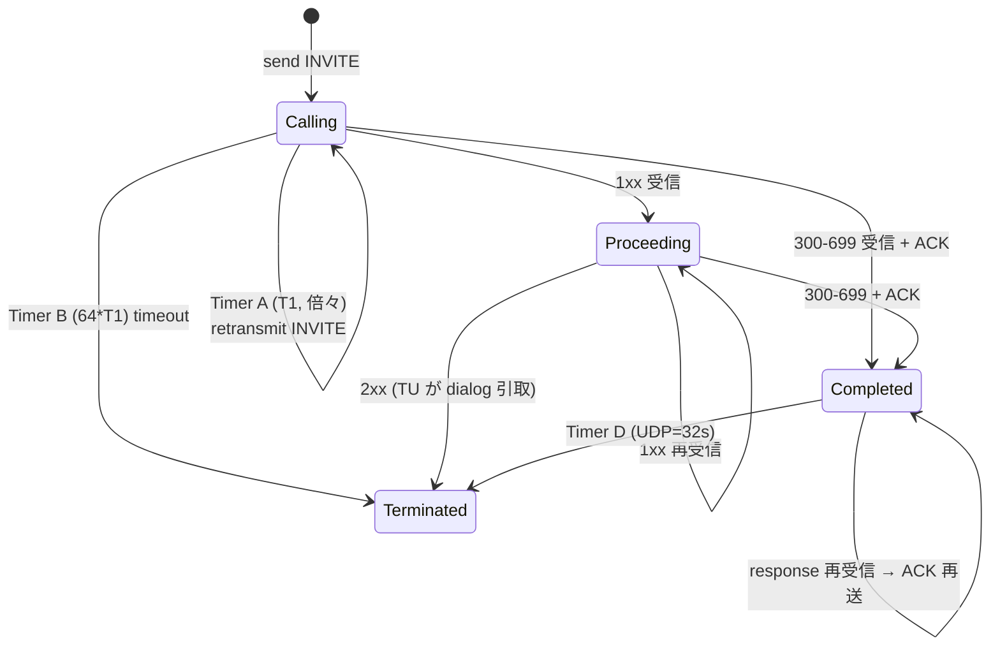
```mermaid
stateDiagram-v2
  [*] --> Calling: send INVITE
  Calling --> Calling: Timer A (T1, 倍々)<br/>retransmit INVITE
  Calling --> Proceeding: 1xx 受信
  Calling --> Completed: 300-699 受信 + ACK
  Calling --> Terminated: Timer B (64*T1) timeout
  Proceeding --> Proceeding: 1xx 再受信
  Proceeding --> Completed: 300-699 + ACK
  Proceeding --> Terminated: 2xx (TU が dialog 引取)
  Completed --> Completed: response 再受信 → ACK 再送
  Completed --> Terminated: Timer D (UDP=32s)
```

実装: `src/sip/transaction.rs::ClientTransaction`。

#### 状態
- `Calling`: INVITE 送信直後 (Timer A 起動, T1 から倍々)。
- `Proceeding`: 1xx 受信後 (Timer A 停止)。
- `Completed`: 300-699 受信 + non-2xx ACK 自動送出 (RFC 3261 §17.1.1.3)。
- `Terminated`: 2xx 受信時 (TU = Uac::invite が dialog を引き取る) または Timer B 満了。

#### 既知のギャップ
- 2xx ACK は Uac 側で 1 度だけ送る (`uac.rs:170`)。**Timer L (RFC 6026)** で 64*T1 維持し response 再送に対する ACK 再送が必要。

### 5.2 INVITE Server Transaction (RFC 3261 §17.2.1, Figure 7) — **未実装多数**

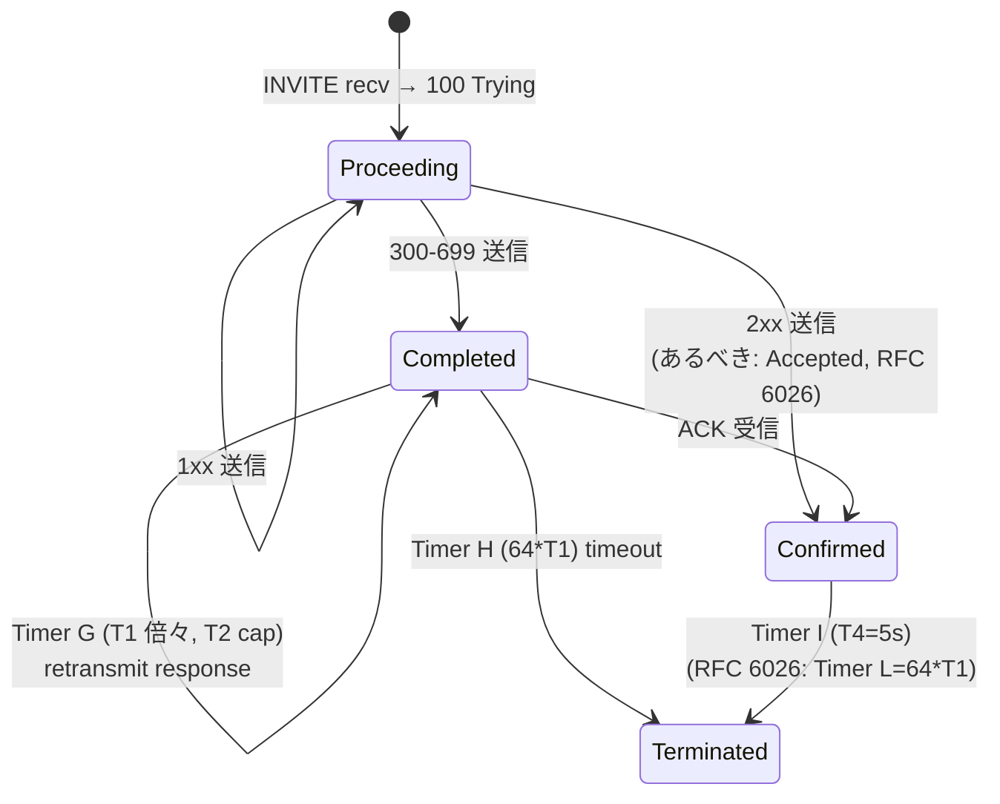
```mermaid
stateDiagram-v2
  [*] --> Proceeding: INVITE recv → 100 Trying
  Proceeding --> Proceeding: 1xx 送信
  Proceeding --> Completed: 300-699 送信
  Proceeding --> Confirmed: 2xx 送信<br/>(あるべき: Accepted, RFC 6026)
  Completed --> Completed: Timer G (T1 倍々, T2 cap)<br/>retransmit response
  Completed --> Confirmed: ACK 受信
  Completed --> Terminated: Timer H (64*T1) timeout
  Confirmed --> Terminated: Timer I (T4=5s)<br/>(RFC 6026: Timer L=64*T1)
```

実装: `src/sip/transaction.rs::ServerTransaction` (但し Timer G/H/I/L 未実装)。

#### 現状実装の制約
- Timer G/H/I は driver なし (`handle_retransmit` 関数だけ存在し駆動コードなし)。
- 結果として「200 OK を送って終わり」状態で、**ACK 待ち再送なし**、 ACK ロスを許容できない。

### 5.3 non-INVITE Client Transaction (RFC 3261 §17.1.2, Figure 6)

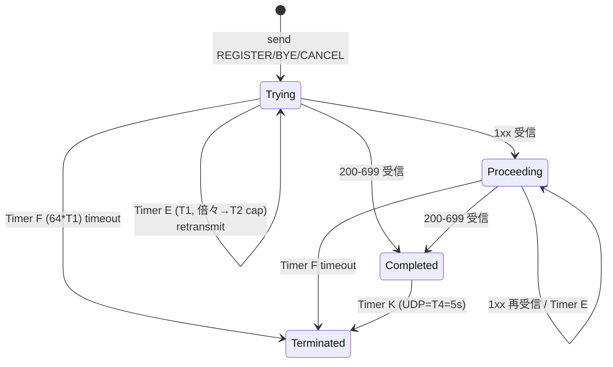
```mermaid
stateDiagram-v2
  [*] --> Trying: send REGISTER/BYE/CANCEL
  Trying --> Trying: Timer E (T1, 倍々→T2 cap)<br/>retransmit
  Trying --> Proceeding: 1xx 受信
  Trying --> Completed: 200-699 受信
  Trying --> Terminated: Timer F (64*T1) timeout
  Proceeding --> Proceeding: 1xx 再受信 / Timer E
  Proceeding --> Completed: 200-699 受信
  Proceeding --> Terminated: Timer F timeout
  Completed --> Terminated: Timer K (UDP=T4=5s)
```

実装: `ClientTransaction` を method で分岐 (INVITE→Calling, それ以外→Trying)。

### 5.4 non-INVITE Server Transaction

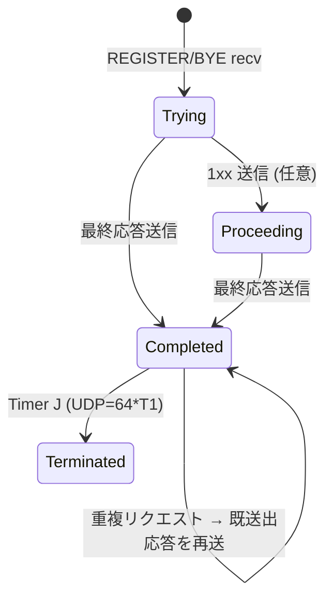
```mermaid
stateDiagram-v2
  [*] --> Trying: REGISTER/BYE recv
  Trying --> Proceeding: 1xx 送信 (任意)
  Trying --> Completed: 最終応答送信
  Proceeding --> Completed: 最終応答送信
  Completed --> Completed: 重複リクエスト → 既送出応答を再送
  Completed --> Terminated: Timer J (UDP=64*T1)
```

実装: 現状 `ServerTransaction` だが Timer J driver なし (Phase R5)。

### 5.5 SIP Dialog (RFC 3261 §12)

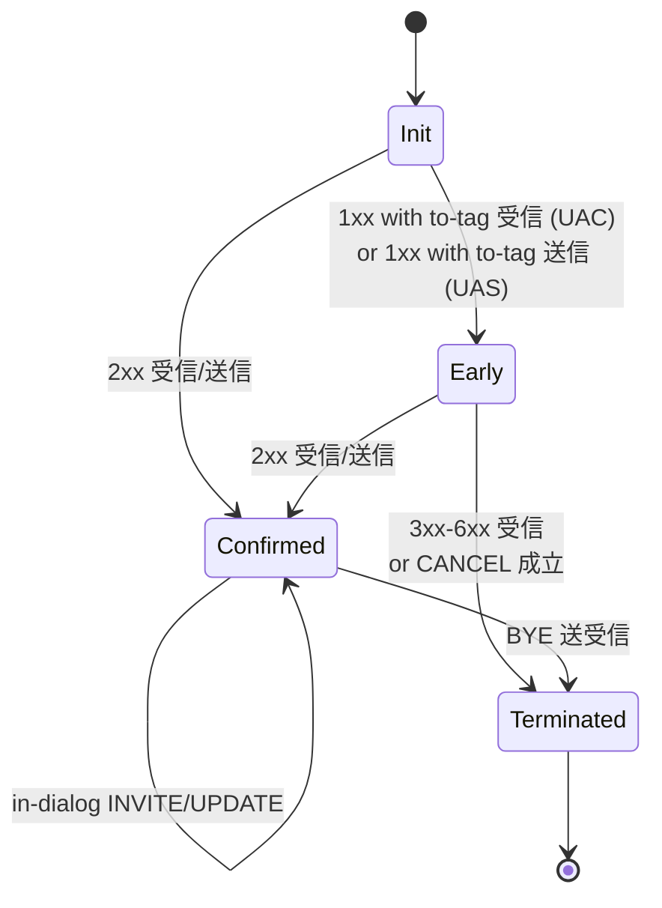
```mermaid
stateDiagram-v2
  [*] --> Init
  Init --> Early: 1xx with to-tag 受信 (UAC)<br/>or 1xx with to-tag 送信 (UAS)
  Init --> Confirmed: 2xx 受信/送信
  Early --> Confirmed: 2xx 受信/送信
  Early --> Terminated: 3xx-6xx 受信<br/>or CANCEL 成立
  Confirmed --> Confirmed: in-dialog INVITE/UPDATE
  Confirmed --> Terminated: BYE 送受信
  Terminated --> [*]
```

実装: `src/sip/dialog.rs::DialogState`, `Dialog::from_uac_response` /
`Dialog::from_uas_invite`。

#### 制約
- `from_uac_response` は 1xx with to-tag → Early と 2xx → Confirmed の両方を扱う。
- 同 Call-ID の forking dialog (1 INVITE → 複数 dialog) は **未対応** (1 INVITE = 1 Dialog 前提、B2BUA としては妥当)。

### 5.6 B2BUA 通話 (Outbound, あるべき)

`refactor-plan §1.3` の `B2buaCall` 案を反映した Outbound (内線→NGN) 状態機械。**現状実装は 2 つの handler に分散**しており、本図はリファクタ後 (Phase R4) のあるべき姿。

```mermaid
stateDiagram-v2
  [*] --> ExtInviteReceived: ExtensionUas.INVITE
  ExtInviteReceived --> NegotiatingSdp: prepare_outbound_bridge<br/>(SDP rewrite for NGN)
  NegotiatingSdp --> NgnInviteSent: Uac::build_invite + send
  NgnInviteSent --> NgnInviteSent: 1xx provisional<br/>(Early dialog)
  NgnInviteSent --> EstablishedNoAck: NGN 200 OK<br/>(2xx ACK 送信)
  NgnInviteSent --> Cancelled: 内線 CANCEL → cancel_pending<br/>(後続 2xx は BYE で打ち消し)
  NgnInviteSent --> Failed: 4xx-6xx<br/>(internal 487/486/...)
  EstablishedNoAck --> Connected: 内線 ACK 受信<br/>(両側 dialog Confirmed)
  EstablishedNoAck --> Terminating: 内線がすぐ BYE
  Connected --> Terminating: 内線 BYE / NGN BYE
  Connected --> Connected: Re-INVITE / UPDATE<br/>(Session Timer refresh)
  Cancelled --> [*]: 487 を内線へ返却
  Failed --> [*]: status を内線へ転送
  Terminating --> [*]: 200 OK (BYE) 両側 + bridge.stop
```

### 5.7 B2BUA 通話 (Inbound, あるべき)

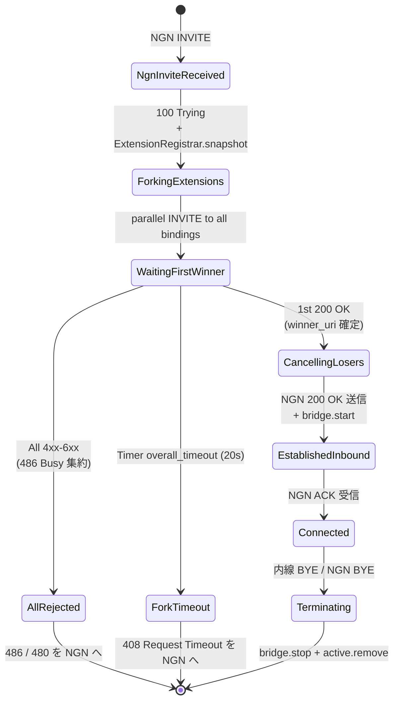
```mermaid
stateDiagram-v2
  [*] --> NgnInviteReceived: NGN INVITE
  NgnInviteReceived --> ForkingExtensions: 100 Trying<br/>+ ExtensionRegistrar.snapshot
  ForkingExtensions --> WaitingFirstWinner: parallel INVITE to all bindings
  WaitingFirstWinner --> CancellingLosers: 1st 200 OK<br/>(winner_uri 確定)
  WaitingFirstWinner --> AllRejected: All 4xx-6xx<br/>(486 Busy 集約)
  WaitingFirstWinner --> ForkTimeout: Timer overall_timeout (20s)
  CancellingLosers --> EstablishedInbound: NGN 200 OK 送信<br/>+ bridge.start
  EstablishedInbound --> Connected: NGN ACK 受信
  Connected --> Terminating: 内線 BYE / NGN BYE
  AllRejected --> [*]: 486 / 480 を NGN へ
  ForkTimeout --> [*]: 408 Request Timeout を NGN へ
  Terminating --> [*]: bridge.stop + active.remove
```

### 5.8 PWA SignalingClient 接続状態 (Issue #119)

ブラウザ PWA (`frontend/src/lib/signaling.ts::SignalingClient`) の WS 接続状態
機械。 W3C WebSocket API §10.7 では「open 後の close からの再接続は application
責務」と明記されており、 sabiden PWA は「自宅電話受話器の代替」 として常時待機が
前提なので、 WiFi 電源管理 / モバイルデータ切替 / Cloudflare Tunnel idle timeout
で WS が落ちても自動で復旧する必要がある。

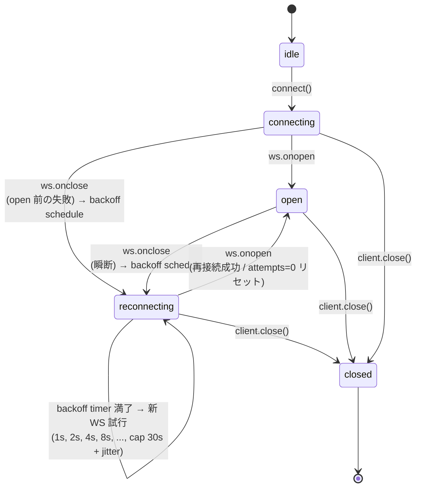
```mermaid
stateDiagram-v2
  [*] --> idle
  idle --> connecting: connect()
  connecting --> open: ws.onopen
  connecting --> reconnecting: ws.onclose<br/>(open 前の失敗) → backoff schedule
  open --> reconnecting: ws.onclose<br/>(瞬断) → backoff schedule
  reconnecting --> reconnecting: backoff timer 満了 → 新 WS 試行<br/>(1s, 2s, 4s, 8s, ..., cap 30s + jitter)
  reconnecting --> open: ws.onopen<br/>(再接続成功 / attempts=0 リセット)
  reconnecting --> closed: client.close()
  open --> closed: client.close()
  connecting --> closed: client.close()
  closed --> [*]
```

ポイント:
- backoff は **`min(maxDelayMs, initialDelayMs * 2^attempt) + jitter(0..maxJitterMs)`**。
  既定で `initialDelayMs=1000`, `maxDelayMs=30000`, `maxJitterMs=250` (Issue #119 DoD)。
- `ws.onopen` で `reconnectAttempts` を 0 にリセットするため、 一度復旧すれば
  次回切断は再び 1s 後に試行する (連続切断による発散を防止)。
- `onOpen` ハンドラは初回 / 再接続いずれの open でも発火する。 `App.tsx` は
  ここで毎回 `register` を送り、 sabiden 側 WS セッション = 内線登録 の lifetime
  に再追従する。 トークンは `localStorage` に保管されているため、 ブラウザを
  reload しても保持される (`frontend/src/lib/storage.ts`)。
- `client.close()` を呼ぶと以後の自動再接続は停止する (ログアウト時)。

---

## 6. 抽象モデル (Class Diagram)

主要構造体と Trait の関係を示す。`?` は Phase R3-R6 で導入予定の関係。

```mermaid
classDiagram
  class TransactionLayer {
    +Arc~UdpSocket~ socket
    +HashMap~TransactionId,ClientTx~ client_tx_table
    -spawn(Arc~UdpSocket~) (Self, mpsc::Receiver~InboundRequest~)
    -spawn_with_tracer(socket, tracer) (Self, rx)
    +send_request(req, dst) Result~SipResponse~
    +send_request_no_wait(req, dst) Result~()~
  }

  class TransactionId {
    +String branch
    +String sent_by
    +SipMethod method
    +from_request(req) Result~Self~
    +from_response(resp) Result~Self~
  }

  class ClientTransaction {
    +TransactionId id
    +SipRequest request
    +SocketAddr destination
    +ClientState state
    +run() Result~SipResponse~
  }

  class ServerTransaction {
    +TransactionId id
    +SipRequest request
    +SocketAddr remote
    +ServerState state
    +respond(resp) Result~()~
    +last_response Option~SipResponse~
  }

  class Dialog {
    +DialogId id
    +DialogState state
    +String local_uri
    +String remote_uri
    +String remote_target
    +Vec~String~ route_set
    +AtomicU32 local_cseq
    +from_uac_response(req, resp, cfg) Result~Self~
    +build_bye() SipRequest
    +build_reinvite(sdp) SipRequest
    +build_ack_for_2xx(cseq) SipRequest
  }

  class DialogId {
    +String call_id
    +String local_tag
    +String remote_tag
  }

  class Uac {
    +UacConfig config
    +Arc~TransactionLayer~ layer
    +SocketAddr server_addr
    +AtomicU32 cseq_counter
    +build_invite(uri, sdp) InvitePlan
    +invite(plan) Result~InviteOutcome~
    +cancel_pending(plan) Result~SipResponse~
  }

  class InvitePlan {
    +SipRequest request
    +u32 cseq
    +String target_uri
    +u32 session_expires
  }

  class UacDialog {
    +Dialog dialog
    +u32 invite_cseq
    +u32 session_expires
    +Arc~TransactionLayer~ layer
    +SocketAddr server_addr
    +send_bye() Result~SipResponse~
    +send_reinvite(sdp) Result~SipResponse~
  }

  class ExtensionUas {
    +UasConfig config
    +AuthDb auth_db
    +Arc~UdpSocket~ socket
    +Arc~ExtensionRegistrar~ registrar
    +Option~mpsc::Sender~UasEvent~~ event_tx
    +run() Result~()~
  }

  class UasEvent {
    <<enumeration>>
    Invite{ from_aor, request, remote, responder }
    Bye{ request, remote }
    --[Phase R4]--
    Cancel
    Reinvite
    Update
  }

  class ResponderHandle {
    +Arc~Mutex~ServerTransaction~~ inner
    +respond(resp) Result~()~
    +quick(status, reason) Result~()~
    +respond_with_body(status, reason, ct, body) Result~()~
  }

  class ExtensionRegistrar {
    +RwLock~HashMap~String,Binding~~ inner
    +register(aor, contact, remote, expires)
    +unregister(aor)
    +lookup(aor) Option~Binding~
    +snapshot() Vec
  }

  class Binding {
    +String contact_uri
    +SocketAddr remote
    +Instant expires_at
    --Phase R6--
    +Box~dyn ExtCallTarget~ transport?
  }

  class NgnInboundHandler {
    +Arc~UdpSocket~ socket
    +ExtInviter inviter
    +Arc~ExtensionRegistrar~ extensions
    +HashMap~call_id,ServerTx~ pending
    +HashMap~call_id,Option~CallId~~ active
    +Option~Arc~CallManager~~ call_manager
    +handle_invite(req, remote)
    +handle_bye(req, remote)
  }

  class UasEventHandler {
    +Arc~Uac~ ngn_uac
    +Option~Arc~CallManager~~ call_manager
    +HashMap~call_id,Option~CallId~~ active
    +handle_event(UasEvent)
    +prepare_outbound_bridge(ext_offer)
    +finalize_outbound_bridge(ctx, ext_offer, ngn_answer)
  }

  class CallManager {
    +HashMap~CallId,RtpBridge~ bridges
    +create_call() CallId
    +attach_bridge(id, bridge)
    +terminate(id)
  }

  class RtpBridge {
    +BridgeConfig
    +JoinHandle ngn_handle
    +JoinHandle ext_handle
    +start(BridgeConfig) Result~Self~
    +stop()
  }

  class TranscodingBridge {
    +TranscodeConfig
    +JoinHandle ngn_to_web
    +JoinHandle web_to_ngn
    +start(TranscodeConfig) Result~Self~
  }

  class PeerSession {
    <<interface>>
    +handle_offer(sdp) Result~String~
    +add_ice_candidate(c) Result~()~
    +take_local_candidates() Option~mpsc::Receiver~String~~
    +close() Result~()~
  }

  class Str0mPeerSession {
    +mpsc::Sender~Command~ cmd_tx
    +Mutex~Option~mpsc::Receiver~String~~~ local_cand_rx
    +run_loop()
  }

  class StubPeerSession

  class SignalingState {
    +Arc~Verifier~ verifier
    +Arc~ExtensionRegistrar~ extensions
    +Duration register_ttl
    +PeerFactory peer_factory
  }

  class B2buaCall {
    <<Phase R4>>
    +CallId id
    +B2buaDirection direction
    +Mutex~B2buaState~ state
    +String ext_call_id
    +String ngn_call_id
    +Mutex~Dialog~ ext_dialog
    +Mutex~Option~UacDialog~~ ngn_dialog
    +Mutex~Option~BridgeKind~~ bridge
    +Notify cancel
  }

  class B2buaRegistry {
    <<Phase R4>>
    +HashMap~CallId,Arc~B2buaCall~~ by_call_id
    +HashMap~String,CallId~ by_ext_call_id
    +HashMap~String,CallId~ by_ngn_call_id
  }

  TransactionLayer "1" *-- "many" ClientTransaction
  TransactionLayer "1" *-- "many" ServerTransaction
  ClientTransaction --> TransactionId
  ServerTransaction --> TransactionId
  Uac --> TransactionLayer
  Uac --> InvitePlan : build_invite
  Uac --> UacDialog : on 2xx
  UacDialog --> Dialog
  Dialog --> DialogId
  ExtensionUas --> ExtensionRegistrar
  ExtensionUas --> ResponderHandle : per request
  ExtensionUas ..> UasEvent : send via mpsc
  ResponderHandle --> ServerTransaction
  ExtensionRegistrar "1" *-- "many" Binding
  NgnInboundHandler --> ExtensionRegistrar
  NgnInboundHandler --> CallManager
  NgnInboundHandler --> RtpBridge : start
  UasEventHandler --> Uac
  UasEventHandler --> CallManager
  CallManager "1" *-- "many" RtpBridge
  CallManager ..> TranscodingBridge : Phase R6
  PeerSession <|.. Str0mPeerSession
  PeerSession <|.. StubPeerSession
  SignalingState --> ExtensionRegistrar
  SignalingState --> PeerSession : factory
  Str0mPeerSession ..> TranscodingBridge : Phase R6 (#29)
  B2buaRegistry "1" *-- "many" B2buaCall
  B2buaCall --> Dialog : ext_dialog
  B2buaCall --> UacDialog : ngn_dialog
```

### 6.1 「あるべき」レジストリ統合 (Phase R4)

現状: `NgnInboundHandler::pending` / `active` と `UasEventHandler::active` の
**3 種類のテーブル**で別々に管理 → BYE 連動時に lookup 漏れ。

あるべき: `B2buaRegistry` 単一テーブルが `(call_id, ext_call_id, ngn_call_id)` の
3 つのキーから同じ `Arc<B2buaCall>` を引ける構造。

```rust
// 提案 (refactor-plan §1.3 より)
pub struct B2buaRegistry {
    by_call_id: HashMap<CallId, Arc<B2buaCall>>,
    by_ext_call_id: HashMap<String, CallId>,
    by_ngn_call_id: HashMap<String, CallId>,
}
```

### 6.2 PendingAnswers の置き場所 (現状の層越境)

現状 `webrtc::signaling::PendingAnswers` が `registrar.rs` で再 import されている (main 系)。あるべきは `crate::sip::registrar::ExtTransport` を Trait object 化し、`webrtc::binding::WebRtcCallTarget` が SIP レイヤを介さずに B2BUA orchestrator から呼べるようにする (Phase R6)。

---

## 7. NGN 仕様まとめ

実機 pcap (Asterisk + sabiden) と project memory から確定した NTT NGN
P-CSCF (118.177.125.1, NTT 東日本系) の挙動を集約する。
詳細は [asterisk-real-invite.md](./asterisk-real-invite.md) /
[asterisk-ngn-invite-spec.md](./asterisk-ngn-invite-spec.md) を参照。

### 7.1 SIP メッセージ要件

| 項目 | 要件 | 根拠 |
|---|---|---|
| **送信元 UDP port** | **必ず 5060** | NGN は受信時の Via `;rport` を無視し、回線単位で「送り返すポート」を保持しているため、5070 等で送ると 100 Trying は 5060 へ返ってきて到達不能 ([asterisk-real-invite.md §3.2](./asterisk-real-invite.md)) |
| **REGISTER** | `Authorization` ヘッダ無しで通る (NGN 直収モード) | 回線認証ベース (HGW WAN MAC + DHCPv4 lease) ([reference_ngn_verify.md](memory)) |
| **REGISTER Request-URI** | `sip:ntt-east.ne.jp` (user 部なし、ドメイン直接) | iwamazonjp 実機 ([asterisk-ngn-invite-spec.md §1.4](./asterisk-ngn-invite-spec.md)) |
| **INVITE Request-URI** | **P-CSCF IP+port** (`sip:117@118.177.125.1:5060`) | sabiden が NGN ドメイン宛に投げると 403。Asterisk pcap で確認 ([asterisk-real-invite.md §5.1](./asterisk-real-invite.md)) |
| **INVITE To URI** | P-CSCF IP host (`<sip:117@118.177.125.1>`, port なし) | Asterisk 流儀 (port は Request-URI のみ) |
| **From URI host** | `ntt-east.ne.jp` (NGN ドメイン) | Asterisk `from_domain=ntt-east.ne.jp` |
| **Via** | `SIP/2.0/UDP <eth1-IP>:5060;branch=z9hG4bK<rand>` | rport は NGN は無視するが、Asterisk と差分減らすために `;rport` 付けるのが現状実装 |
| **Via `;rport`** | **付けて OK** (Asterisk 流儀)。受信処理で NGN は無視するが拒否はしない | commit `c9e3563` 以降 |
| **Contact** | `<sip:0312345678@<eth1-IP>:5060>` (NGN 側 IP) | `local_addr` auto-detect (Issue #35) |
| **Allow** | 最低 `INVITE, ACK, CANCEL, OPTIONS, BYE, INFO, NOTIFY`。Asterisk PJSIP は `PRACK, UPDATE, MESSAGE` も含む | NGN 仕様非公開、UPDATE は §4 推奨 |
| **Supported** | `timer` 必須 (`replaces` も含めると Asterisk 互換) | Session Timer 用 |
| **Session-Expires** | `300;refresher=uac` (NGN 既定 300 秒、refresher は UAC) | RFC 4028 |
| **Min-SE** | `90` | RFC 4028 既定 |
| **P-Preferred-Identity** | **不要** (Asterisk pcap で無し成立確認) | [asterisk-real-invite.md §5.3](./asterisk-real-invite.md) |
| **P-Asserted-Identity** | **不要** (上記同) | 同上 |
| **Privacy** | **削除推奨** (`Privacy: none` は規格的には valid だが、出さない方が NGN 互換) | Asterisk PJSIP の自動生成は `id` のみ |
| **コンパクトヘッダ受信** | `v/f/t/i/m/l/s/c/k/e` を受け取り正規化必須 | NGN 200 OK で混ざる ([project_ngn_compact_headers.md](memory)) |
| **DSCP** | TOS 0x80 (DSCP 32) | `IPV6_TCLASS` + `IP_TOS` 両方セット (Issue #37) |

### 7.2 SDP 要件

| 項目 | 要件 | 根拠 |
|---|---|---|
| **`o=` username** | `-` (anonymous origin) — 内線由来の `iphone` 等を残すと NGN は 500 を返す | commit `4b3d556` |
| **`o=` IP / `c=` IP** | **eth1 グローバル IP (NGN 側 /30 lease)** | LAN private IP を残すと 488 ([asterisk-real-invite.md §5.2](./asterisk-real-invite.md)) |
| **`m=audio` formats** | **`0` のみ** (PCMU)。Opus/Speex/G.729/telephone-event を並べると 488 | [project_ngn_quirks.md](memory) |
| **`a=rtpmap:0`** | `PCMU/8000` (or `PCMU/8000/1`) | RFC 3551 §4.5.14 |
| **`a=ptime`** | `20` (NGN 既定) | NGN 200 OK でこれを返す |
| **`a=sendrecv`** | あり | 双方向音声前提 |
| **`m=audio` port** | sabiden が bind した RTP socket port (中継用) | B2BUA として両側を切り離す |

#### NGN 着信 (`NGN→sabiden`) の SDP 例

```
v=0
o=- 85704 85704 IN IP4 118.177.125.1
s=-
c=IN IP4 118.177.125.1
t=0 0
m=audio 24252 RTP/AVP 0 101
a=rtpmap:0 PCMU/8000/1
a=rtpmap:101 telephone-event/8000
a=fmtp:101 0-15
```

(NGN 側は `telephone-event` を送ってくる。sabiden は受け流すのみ → 内線へ
そのまま伝搬する場合は SDP の `formats` に `101` を残す必要がある。
あるべきは `Negotiator::for_ext` で内線が出した formats と AND を取り、
PT が一致したものだけ残す Phase R3。)

### 7.3 RTP / RTCP

| 項目 | 値 |
|---|---|
| Codec | G.711 μ-law (PT=0), 20ms ptime, 160 samples/frame, 8 kHz, mono |
| RTP Padding | なし (Asterisk 流儀) |
| RTCP | sabiden は SR/RR を送出。NGN 側は SR を返してくる (受信統計) |
| DTMF | inband PCMU 想定 (telephone-event は通すが、未検証) |

### 7.4 着信 (NGN → sabiden) の SIP 特性

- **From: anonymous** が来るケースあり (`f: <sip:anonymous@anonymous.invalid>`)。
  発信者番号は `P-Called-Party-ID` 等の追加ヘッダから推測する必要がある (現状非対応)。
- **Allow** に `PRACK, UPDATE` が入る。
- **Supported** に `timer, 100rel`。
- **Record-Route** に P-CSCF (`<sip:118.177.125.1:5060;lr>`) が必ず入る。
  → loose routing で ACK / BYE は P-CSCF を経由する。

---

## 8. 不変条件 (B2BUA Invariants)

B2BUA 実装が **常に** 満たすべき条件。実装テストはこれらを invariant
property として書く (Phase R1 で `tests/integration/` に集約予定)。

### 8.1 SIP プロトコル不変条件

| # | 不変条件 | 根拠 |
|---|---|---|
| I-1 | 送信した INVITE には対応する `Dialog` (Early or Confirmed) が常に存在する | RFC 3261 §12.1 |
| I-2 | `2xx` を受信した INVITE には **必ず** ACK を送出する | RFC 3261 §13.2.2.4 |
| I-3 | `3xx-6xx` を受信した INVITE には **必ず** non-2xx ACK を送出する (transaction layer の責務) | RFC 3261 §17.1.1.3 |
| I-4 | CANCEL の Via branch / Call-ID / CSeq number は元 INVITE と同一 | RFC 3261 §9.1 |
| I-5 | 200 OK 後の dialog では in-dialog request の To-tag = 元 dialog の remote-tag | RFC 3261 §12.2.1.1 |
| I-6 | UAS が 2xx を送ったら、ACK 受信前は **BYE を送れない** (Confirmed dialog のみ BYE 可) | RFC 3261 §15 |
| I-7 | `Max-Forwards` を transit するときに decrement する (B2BUA は 70 で常に再生成) | RFC 3261 §16.6 |
| I-8 | Via header は新規 INVITE 生成時に sabiden の sent-by を **唯一の**先頭 Via として書く (B2BUA は proxy ではない) | RFC 5853 §3 |

### 8.2 B2BUA 整合性不変条件

| # | 不変条件 | 補足 |
|---|---|---|
| I-9 | Outbound (内線→NGN) の場合、内線 Call-ID と NGN Call-ID は **異なる** (B2BUA で再生成) | `new_call_id()` を 2 回呼ぶ |
| I-10 | Outbound 通話の `B2buaCall::ext_dialog` (内線 UAS dialog) と `ngn_dialog` (NGN UAC dialog) は **同時に Confirmed か同時に Terminated** | BYE 連動 |
| I-11 | NGN→内線 BYE は内線 dialog の BYE を発射し、その逆も真 | `B2buaCall::handle_bye` |
| I-12 | レジストリ lookup は `(call_id, ext_call_id, ngn_call_id)` の 3 キーすべてから同じ `Arc<B2buaCall>` を返す | Phase R4 `B2buaRegistry` |
| I-13 | `RtpBridge` は両側 dialog が `Confirmed` のときのみ起動可、片側 Terminated なら停止 | bridge.stop() idempotent |
| I-14 | CANCEL race で 200 OK が CANCEL より先に届いた場合、即 BYE を発射する | `cancelled_flag` (現状) / `CancelState::GlareWith2xx` (Phase R4) |

### 8.3 メディア層不変条件

| # | 不変条件 | 補足 |
|---|---|---|
| I-15 | NGN レッグの SDP `m=audio` は **PCMU only** (PT=0) | NGN は他の codec で 488 |
| I-16 | NGN レッグの SDP `c=` / `o=` IP は **eth1 IP** (LAN private は禁止) | `o=` username も `-` 必須 |
| I-17 | RTP socket の DSCP は 32 (TOS 0x80) | NGN QoS 要件 |
| I-18 | WebRTC レッグでは Opus 48kHz/stereo を使い、NGN レッグへ G.711 8kHz/mono にトランスコード (Phase R6 で結線) | RFC 6716 / RFC 3551 |
| I-19 | RTP peer は late-binding (最初の受信パケットの送信元で確定) | NAT 越え耐性 |

### 8.4 セキュリティ不変条件

| # | 不変条件 | 補足 |
|---|---|---|
| I-20 | SIP `Authorization` / `Proxy-Authorization` の値は **トレースで redact** される | `observability::SipTraceWriter` |
| I-21 | WebRTC HMAC トークンは constant-time で比較する | `subtle::ConstantTimeEq` |
| I-22 | Cloudflare Access service token は Worker secret として保持し、フロント JS には露出しない | `wrangler secret put` |

---

## 9. エラーハンドリング戦略

### 9.1 ポリシー

- **`Result` 階層**: 全 fallible API は `anyhow::Result` を返す。低レイヤ
  (`message.rs` のパース等) は `thiserror` で型付きエラーを定義し、上位層で
  `anyhow` にラップ。
- **パニック禁止箇所**:
  - `transaction.rs::recv_loop` (バックグラウンドタスク内): 受信失敗は warn + continue。
  - `signaling.rs::run_session` (WS セッション内): プロトコルエラーは
    `ServerMessage::Error` で返し、セッションは継続 (DoS 耐性)。
  - `bridge.rs::recv_loop` (RTP リレー): UDP recv error は trace + continue。
- **panic 許容箇所**: `main.rs` 起動時のコンフィグパース失敗 (= 起動不能)。

### 9.2 SIP レイヤの再送 / リトライ

| 状況 | 動作 | RFC |
|---|---|---|
| INVITE 送信後、Timer A 期限 | T1 から倍々で再送 | §17.1.1.2 |
| INVITE 送信後、Timer B (64*T1=32s) 経過 | `Err(timeout)` を `Uac::invite` に返す | §17.1.1.2 |
| INVITE 1xx 受信 | Timer A 停止、Timer B は維持 | §17.1.1.2 |
| INVITE 2xx 受信 | dialog 確立、TU が ACK 送出 | §13.2.2.4 |
| INVITE 3xx-6xx 受信 | non-2xx ACK 自動送出 (Completed 状態) | §17.1.1.3 |
| REGISTER 401 受信 | nonce / realm を抽出し Authorization 付き再送 (HGW モードのみ) | §22.3 |
| REGISTER 失敗 (any) | 30 秒待って再送 (現状) → 指数バックオフ (Phase R5) | §10.2 |
| REGISTER 200 受信後 | `expires*0.9` で再 REGISTER | §10.2.4 |

### 9.3 ログレベル基準

| Level | 用途 | 例 |
|---|---|---|
| `error` | プロセス停止につながる致命的状況、invariant 違反 | health server crash, パース不能なコンフィグ |
| `warn` | 個別通話 / リクエストの失敗 (リトライしても回復しない) | INVITE 4xx 確定、フォーク全失敗、トレース書き込み失敗 |
| `info` | 構造変化のあるイベント (起動、登録成功、新通話確立、新 binding) | "REGISTER 成功 次回更新まで X 秒"、"NGN 着信 INVITE" |
| `debug` | フロー追跡用 (各レイヤの状態遷移) | "1xx received", "ACK sent", "fork worker spawned" |
| `trace` | 1 行 / 1 パケットの hot path (RTP forward 等) | "RTP forwarded N bytes" |

### 9.4 Span / Tracing

`tracing::info_span!` でリクエスト単位のコンテキストを以下のフィールドで持つ:

- `call_id`: SIP Call-ID
- `direction`: `"ngn"` (NGN 側) / `"extension"` (内線側)
- `aor`: 内線発信時の発信者 AOR
- `winner_uri`: フォーク勝者 URI

これらは `Instrument` で `async` ブロックを包み、内部のすべての `info!` /
`debug!` に自動付与される。

### 9.5 retryable / non-retryable エラー分類

| エラー分類 | retryable? | 動作 |
|---|---|---|
| UDP send 失敗 (一時的) | yes | Timer A/E で再送 |
| Timer B/F (64*T1) 満了 | no (内側) / yes (上位) | TU は `Err(Timeout)` を返し、上位 (Registrar / B2buaCall) が判断 |
| 401 Unauthorized | yes (1 回まで) | Authorization 付きで再送 |
| 408 Request Timeout | no | Failed として TU 上位へ |
| 4xx Client Error (一般) | no | Failed として TU 上位へ |
| 5xx Server Error | no (現状) → 503/504 のみ retry (Phase R5) | Failed |
| 6xx Global Failure | no | Failed |
| Transport error (host unreachable) | no | `Err` を直接 TU へ |

---

## 10. 観測性 (Observability)

### 10.1 メトリクス (Prometheus text exposition format)

`/metrics` エンドポイントが返すメトリクス。実装は `observability::Metrics` の
`AtomicU64` 群を直書きフォーマットする。

| メトリクス | 種別 | 説明 |
|---|---|---|
| `sabiden_register_success_total` | counter | REGISTER 成功回数 |
| `sabiden_register_fail_total` | counter | REGISTER 失敗回数 |
| `sabiden_invite_ngn_total{result="answered\|busy\|timeout\|error"}` | counter | NGN レッグ INVITE の結果別件数 |
| `sabiden_invite_extension_total{result="..."}` | counter | 内線レッグ INVITE の結果別件数 |
| `sabiden_call_active` | gauge | 確立中通話数 (idempotent +1/-1) |
| `sabiden_rtp_forward_total{direction="ngn_to_ext\|ext_to_ngn"}` | counter | RTP リレーパケット数 |
| `sabiden_extension_registered` | gauge | 登録中の内線数 |

### 10.2 SIP トレース

`--trace-dir <dir>` または `[trace] dir = "..."` で有効化。

- 出力ファイル名: `<unix_ms>_<sent|recv>_<METHOD>_<call_id>.txt`
- 1000 ファイル / 100 MB 超過で古いものから自動削除 (`SipTraceWriter` 内 LRU)
- `Authorization:` ヘッダ値は `<redacted>` に書き換え後保存

### 10.3 構造化ログ (`tracing-subscriber`)

```
RUST_LOG=sabiden=debug ./sabiden register --config config.toml
```

- `with_span_events(NEW | CLOSE)` で span 開閉ログを出す
- `with_target(true)` でモジュールパスを表示

### 10.4 ヘルスチェック

| エンドポイント | 動作 |
|---|---|
| `GET /healthz` | 常に 200 (プロセス生存) |
| `GET /readyz` | REGISTER 成功時のみ 200、それ以外 503 |
| `GET /metrics` | Prometheus メトリクス |
| `GET /signal` | WebSocket upgrade (HMAC token 必須) |

### 10.5 観測カバレッジマトリクス

| イベント | counter | log span | trace file |
|---|---|---|---|
| REGISTER 成功 | ✓ | ✓ (`register`) | ✓ |
| REGISTER 401 / 失敗 | ✓ | ✓ | ✓ |
| NGN 着信 INVITE 受信 | ✓ | ✓ (`ngn_inbound_invite`) | ✓ |
| NGN 着信 200 OK 送信 | ✓ | ✓ | ✓ |
| 内線発信 INVITE | ✓ | ✓ (`uas_invite`) | ✓ |
| BYE 受信/送信 | (call_active --) | ✓ | ✓ |
| RTP パケット転送 | ✓ | trace | ✗ (ハイレート) |
| WebRTC offer/answer | ✗ | ✓ | ✗ (SDP のみ別系統) |
| ICE candidate 交換 | ✗ | debug | ✗ |

---

## 11. セキュリティ境界

### 11.1 制御平面 (Control Plane) と データ平面 (Data Plane) の分離

```mermaid
graph LR
  subgraph Control["制御平面"]
    SIP_Plane["SIP UDP<br/>(NGN 5060 / 内線 5061)"]
    HTTP_Plane["HTTP / WS<br/>(8080)"]
  end
  subgraph Data["データ平面"]
    RTP_Plane["RTP UDP<br/>(動的 port)"]
    SRTP_Plane["DTLS-SRTP<br/>(WebRTC 動的 port)"]
  end
  Auth["Auth Boundary"]
  Control -- "認可済み呼<br/>(call_id 紐付け)" --> Data
  Control -. "Auth: SIP Digest /<br/>WebRTC HMAC /<br/>CF Access" .-> Auth
```

### 11.2 認証境界

| 境界 | 認証方式 | 実装 |
|---|---|---|
| **NGN ↔ sabiden** (NGN 直収) | 回線認証 (送信元 IP+MAC + 5060 source port) | DHCPv4 lease + spoof MAC |
| **NGN ↔ sabiden** (HGW Digest, legacy) | SIP Digest (MD5, RFC 2617) | `auth.rs::DigestCredentials::compute` |
| **内線 UA ↔ sabiden UAS** | SIP Digest (`[[extensions]] password`) | `auth.rs::build_www_authenticate` |
| **ブラウザ ↔ /signal WS** | HMAC-SHA256 token (`webrtc.secret_hex` で発行) | `webrtc::auth::Verifier::verify` |
| **ブラウザ ↔ Cloudflare Edge** | HTTPS + (将来) Cloudflare Access SSO | Worker / CF Access Application |
| **CF Worker ↔ 上流 Tunnel** | Service token (`CF-Access-Client-Id` / `CF-Access-Client-Secret`) | Worker secret |

### 11.3 SIP メッセージのトラスト

- **NGN P-CSCF からの INVITE**: From URI / P-Asserted-Identity を信頼する
  (NGN 内で認可済みのキャリア)。
- **内線 UA からの INVITE**: REGISTER 時の Digest 認証で AOR が確定して
  いれば信頼。Digest 失敗時は INVITE を 401 で蹴る (`uas.rs`)。
- **WebRTC peer からの SDP offer**: HMAC token + ext_id でセッション認証
  ありとみなす。SRTP は str0m が DTLS handshake で確立。

### 11.4 シークレット管理

- **SIP password**: `config.toml` または環境変数 `SABIDEN_SIP_PASSWORD`、
  K8s では `/run/secrets/sabiden/sip_password` をマウント。
- **WebRTC HMAC secret**: `config.toml` の `[webrtc] secret_hex` (32 byte hex)
  または環境変数 `SABIDEN_WEBRTC_SECRET_HEX`。
- **CF Access tokens**: `wrangler secret put` で Cloudflare Worker に保管。
  ローカルにも `.dev.vars` を git ignore。

### 11.5 ネットワーク境界 (推奨)

- **NGN 側 eth1**: NGN P-CSCF (118.177.125.1/32) のみ in/out 許可。
- **内線側 eth0**: LAN セグメント (例: 192.168.30.0/24) のみ。
- **HTTP 8080**: cloudflared Tunnel から localhost 経由で接続させ、外部から
  直接到達不可 (`bind = 0.0.0.0` だが loopback ルールで保護)。

### 11.6 メッセージレベル防御

- **Authorization redact** (§10.2): SIP トレースに password が漏れない。
- **SDP 詰め物攻撃**: parse 失敗で drop → 200 OK を返さないので silent drop。
  あるべきは `400 Bad Request` (Phase R2)。
- **メッセージサイズ上限**: `transaction.rs::recv_loop` の buf は 8192 bytes 固定 →
  大きい SIP メッセージは truncate 危険 (Phase R5 で 64KB に拡張予定)。
- **Content-Length 整合検証** (RFC 3261 §18.3 / §20.14, Issue #82):
  `parse_message` (`src/sip/message.rs`) は `Content-Length` ヘッダ値と
  CRLFCRLF 以降の datagram 残バイト長を比較する。 宣言値が残バイト長より
  大きい場合は **truncate** と見なして `Err` を返し、`recv_loop` で warn
  と共に drop する (≒ 400 Bad Request 相当の silent drop)。 これにより
  8192 byte buf を超えた INVITE / 200 OK が SDP 半分受信のまま下流に流れる
  事故を防ぐ。 値が残より小さい場合は先頭 N バイトのみ採用し、残余は
  別 datagram (もしくは garbage) として drop する。
- **Content-Length 重複検出** (RFC 3261 §7.3.1 / §20.14, Issue #82 follow-up):
  単一値ヘッダである `Content-Length` が同 datagram 内に **2 件以上** 現れた
  場合は `Err` を返す。 attacker が `Content-Length: 0\r\nContent-Length: 999`
  のように食い違う重複を仕込んでも 1 件目だけ採用して silent に通る
  (request smuggling 風) 経路を遮断する。 検出は `headers.get_all("content-length")`
  で `len() >= 2` を判定する。
- **Body の opaque 性 + ヘッダ lossy 化** (RFC 3261 §7.3.1 / §7.4 / §25.1, Issue #82):
  message-body は任意 octet 列で、メッセージ全体に UTF-8 妥当性を要求しない
  (§7.4)。 ヘッダ部は `TEXT-UTF8-TRIM` BNF (§25.1) により多バイト UTF-8 が
  許容されるが、 不正バイトが 1 個混入しても全 datagram drop に至らないよう
  `String::from_utf8_lossy` で U+FFFD 置換してパースを継続する。 これにより、
  攻撃者が任意の場所 (body もヘッダも) に非 UTF-8 バイトを 1 個混ぜるだけで
  SIP メッセージ全体が drop される DoS 経路を遮断する (旧実装は body 経路を
  ふさいでも、ヘッダ経路の strict `from_utf8` で同じ DoS が成立していた)。

---

## 12. 拡張ポイント

将来追加予定の機能とそのフック箇所を明記する。実装時は本文書を更新すること。

### 12.1 Re-INVITE / UPDATE (RFC 3261 §14, RFC 3311) — Session Timer 自動更新

| あるべきフック | 場所 |
|---|---|
| UAS 側 Re-INVITE 受信 | `ExtensionUas::handle_invite` で **dialog 既存判定** を追加し、`UasEvent::Reinvite` を新設 |
| UAC 側 自動 Re-INVITE | `UacDialog::start_refresh_timer(session_expires/2)` を spawn (Phase R4) |
| 422 Session Interval Too Small | `Uac::invite` で 422 受信時に `Min-SE` を更新して再 INVITE |
| UPDATE | `SipMethod::Update` を `uas.rs` の dispatch に追加 (Phase R2) |

### 12.2 PRACK / 100rel (RFC 3262)

| あるべきフック | 場所 |
|---|---|
| `Supported: 100rel` を INVITE に含める | `Uac::build_invite` |
| 1xx with `Require: 100rel` 受信時に PRACK を送る | `ClientTransaction` に PRACK 駆動を追加 |
| UAS 側 PRACK 受信 | `ExtensionUas::handle_prack` (Phase R2) |

### 12.3 着信履歴 / Call Detail Records

| あるべきフック | 場所 |
|---|---|
| 通話開始 (200 OK 確立) で CDR を発火 | `B2buaCall::on_connected` (Phase R4) |
| 通話終了 (BYE / Cancel / 失敗) で CDR を発火 | `B2buaCall::on_terminated` |
| 永続化 | `crate::cdr` 新規モジュール (SQLite or Cloudflare D1) |
| 公開 API | `health::router` に `/calls` を追加 (CF Access 認可必須) |

### 12.4 SMS (RFC 3428 MESSAGE)

| あるべきフック | 場所 |
|---|---|
| `SipMethod::Message` 追加 | `message.rs` |
| `ExtensionUas::handle_message` | `uas.rs` |
| WS シグナリング層に `ClientMessage::SendSms` 追加 | `webrtc/signaling.rs` |
| NGN 側で MESSAGE が来るか実機未確認 | (要 NGN 仕様確認) |

### 12.5 NOTIFY / SUBSCRIBE (RFC 3265, BLF / Reg-Event)

| あるべきフック | 場所 |
|---|---|
| Linphone presence (PUBLISH) 受信 | `uas.rs::handle_publish` で 200 OK を返す (Phase R2) |
| BLF (Busy Lamp Field) 用 NOTIFY を発火 | `B2buaCall::on_state_change` で内線 UA に通知 |

### 12.6 複数回線対応

| あるべきフック | 場所 |
|---|---|
| `[sip]` を `[[sip]]` の配列に拡張 | `config.rs` |
| 各回線に Registrar / Uac を持たせる | `main.rs` 起動時に並列 spawn |
| `static CSEQ` (`register.rs:23`) を Registrar struct field に | Phase R5 |

### 12.7 SBC 機能 (RFC 5853)

現在 sabiden は B2BUA + Topology Hiding を **暗黙に** 実装しているが、
責務として明示するなら `crate::sbc` モジュールを切り出し、以下を集約する:

- `Negotiator` (SDP 翻訳)
- `HeaderFilter` (privacy / proxy header の除去)
- `RouteRewriter` (Record-Route の処理)

---

## 13. 参考

### 13.1 SIP / SDP 関連 RFC

| RFC | タイトル |
|-----|---|
| [RFC 3261](https://datatracker.ietf.org/doc/html/rfc3261) | SIP: Session Initiation Protocol |
| [RFC 3262](https://datatracker.ietf.org/doc/html/rfc3262) | Reliability of Provisional Responses (PRACK / 100rel) |
| [RFC 3264](https://datatracker.ietf.org/doc/html/rfc3264) | An Offer/Answer Model with SDP |
| [RFC 3265](https://datatracker.ietf.org/doc/html/rfc3265) | SIP-Specific Event Notification |
| [RFC 3311](https://datatracker.ietf.org/doc/html/rfc3311) | UPDATE Method |
| [RFC 3325](https://datatracker.ietf.org/doc/html/rfc3325) | P-Asserted-Identity / P-Preferred-Identity / Privacy |
| [RFC 3361](https://datatracker.ietf.org/doc/html/rfc3361) | DHCP Option for SIP Servers |
| [RFC 3428](https://datatracker.ietf.org/doc/html/rfc3428) | MESSAGE Method (SMS) |
| [RFC 3515](https://datatracker.ietf.org/doc/html/rfc3515) | REFER Method |
| [RFC 3550](https://datatracker.ietf.org/doc/html/rfc3550) | RTP: A Transport Protocol for Real-Time Applications |
| [RFC 3551](https://datatracker.ietf.org/doc/html/rfc3551) | RTP Profile for Audio and Video |
| [RFC 3581](https://datatracker.ietf.org/doc/html/rfc3581) | rport (Symmetric Response Routing) |
| [RFC 3903](https://datatracker.ietf.org/doc/html/rfc3903) | PUBLISH Method |
| [RFC 3960](https://datatracker.ietf.org/doc/html/rfc3960) | Early Media |
| [RFC 4028](https://datatracker.ietf.org/doc/html/rfc4028) | Session Timers in SIP |
| [RFC 4566](https://datatracker.ietf.org/doc/html/rfc4566) | SDP: Session Description Protocol |
| [RFC 5245](https://datatracker.ietf.org/doc/html/rfc5245) | ICE (旧版) |
| [RFC 5853](https://datatracker.ietf.org/doc/html/rfc5853) | SBC Functions in SIP Networks |
| [RFC 6026](https://datatracker.ietf.org/doc/html/rfc6026) | Correct Transaction Handling for 2xx Responses (Timer L) |
| [RFC 6716](https://datatracker.ietf.org/doc/html/rfc6716) | Opus Audio Codec |
| [RFC 7587](https://datatracker.ietf.org/doc/html/rfc7587) | RTP Payload Format for Opus |
| [RFC 7616](https://datatracker.ietf.org/doc/html/rfc7616) | HTTP Digest Access Authentication (SHA-256) |
| [RFC 8445](https://datatracker.ietf.org/doc/html/rfc8445) | ICE (改訂版) |
| [RFC 8835](https://datatracker.ietf.org/doc/html/rfc8835) | WebRTC Transports |

### 13.2 関連ドキュメント (リポジトリ内)

| パス | 内容 |
|---|---|
| [docs/refactor-plan.md](./refactor-plan.md) | 現状実装の責務分析 + リファクタ計画 (R1-R6) |
| [docs/asterisk-real-invite.md](./asterisk-real-invite.md) | NGN 直収 INVITE の実機 pcap 解析 (Asterisk で 200 OK 取得) |
| [docs/asterisk-ngn-invite-spec.md](./asterisk-ngn-invite-spec.md) | Asterisk ソースから抽出した正しい INVITE 構造 |
| [docs/ARCHITECTURE.md](./ARCHITECTURE.md) | 旧 ARCHITECTURE.md (簡易概要、本文書が後継) |
| [docs/INSTALL.md](./INSTALL.md) | 実機インストール手順 |
| [docs/CLOUDFLARE.md](./CLOUDFLARE.md) | Cloudflare Tunnel + Workers デプロイ |
| [README.md](../README.md) | プロジェクト全体概要 |
| [config.example.toml](../config.example.toml) | 設定モデル |
| [frontend/README.md](../frontend/README.md) | PWA フロントエンド |
| [deploy/](../deploy) | systemd / docker / k8s / dhcp 配備資材 |

### 13.3 主要 Issue

- **#46**: 本ドキュメント (HLD)
- **#15**: B2BUA orchestrator 結線
- **#22**: 観測性 (SIP trace + metrics)
- **#23**: WebRTC シグナリング (PR #26)
- **#28**: str0m バックエンド (PR #32)
- **#29**: Opus トランスコード結線 (進行中)
- **#35**: local_addr auto-detect
- **#37**: NGN 直収モード (PR #38)

---

## Appendix A. Assumption / Open Questions

本 HLD を書くにあたり、検証なしに前提とした事項と、未解決の疑問を残す。
今後の実装で各項目に決着がついたら、本付録を更新する。

### A.1 Assumption (検証不十分な前提)

1. **NGN P-CSCF の挙動は東日本 NTT (118.177.125.1) と同じく西日本にも適用できる**
   実機検証は東日本のみ。西日本の P-CSCF は別 IP / 別仕様の可能性。
2. **`Session-Expires=300` を NGN P-CSCF が拒否しない**
   `[asterisk-real-invite.md §3.1](./asterisk-real-invite.md)` で実機 200 OK
   は確認できているが、422 Session Interval Too Small が出たケースは未観測。
3. **NGN は IPv4 と IPv6 両方の SIP path を許容する**
   NGN 直収では IPv4 path で REGISTER できることを確認済み (Issue #37)。
   従来構成 (HGW 経由) では IPv6。混在環境での `IPV6_TCLASS` / `IP_TOS`
   両セットの効果は kernel 依存。
4. **`str0m 0.19` の ICE-Lite はブラウザ controlling と完全互換**
   Cloudflare Tunnel 配下では問題ないが、direct connection で TURN 必須に
   なる可能性。
5. **`OutboundCallRegistry` の単一 `Mutex<HashMap>` で同時 100 通話まで
   contention 問題なし**
   1 通話あたり数イベントしか走らないため。同時通話 100 件超では再評価必要。
6. **Linphone 内線からの SDP offer は常に PCMU を含む**
   最近の Linphone は audio codec preference に PCMU が無効化されている
   設定があり得る。Phase R3 で内線側 codec policy 強制が必要かも。
7. **WebRTC peer の SDP offer に Opus が常に含まれる**
   Chromium 系は Opus がデフォルト。Safari でも Opus は出るが PT 値が異なる
   (動的 PT の SDP rewrite 必須)。

### A.2 未解決事項 (Open Questions)

#### A.2.1 NGN 仕様の灰色領域

1. **NGN P-CSCF が要求する `Allow` の最低集合**
   iwamazonjp の REGISTER は `PRACK,UPDATE,MESSAGE` を含むが、INVITE で
   何が必須かは個体差あり。OPTIONS / NOTIFY を必須とする報告は無いが
   排除する根拠もない。
2. **`;user=phone` がどの URI に必須か**
   Asterisk PJSIP は Request-URI / From URI に乗せる。Contact には乗らない。
   sabiden は **未対応**。実機 INVITE 200 OK は `;user=phone` なしで取得済み
   ([asterisk-real-invite.md §5](./asterisk-real-invite.md)) なので
   優先度は低いが、特定回線で要求される可能性あり。
3. **Privacy ヘッダの存在自体を NGN が要求するか**
   sabiden は PPI/Privacy を `c9e3563` で削除し 200 OK を取れた。一方
   現状コメントに「NGN は Privacy ヘッダの存在自体を要求」と書いた経緯が
   あり、これは誤りの可能性がある。
4. **NGN 着信での発信者番号特定**
   `f: <sip:anonymous@anonymous.invalid>` で来るケースの番号付帯ヘッダ
   (`P-Called-Party-ID` / `P-Asserted-Identity` / `Remote-Party-ID`) は
   NGN 仕様非公開で定まらない。実機着信 trace の蓄積が必要。
5. **NGN の DTMF 方式**
   inband (RFC 2833 telephone-event PT=101) なのか PCMU 内 inband なのか
   未確認。SDP offer に `telephone-event` を載せるかどうかも未決。

#### A.2.2 sabiden 実装の灰色領域

1. **NGN 着信 (NGN→内線) 実機未検証**
   `NgnInboundHandler` の単体テスト / ローカル loopback 結合テストは揃って
   いるが、実電話番号 (0191349809) への外部ダイヤルでの確認は未実施
   ([refactor-plan.md §6 P2](./refactor-plan.md))。
2. **`bridge_ngn_bind_ip` の自動決定**
   `main.rs` で config 未指定時は `IpAddr::V4(LOCALHOST)` フォールバック
   (`orchestrator.rs:506`)。NGN は IPv4 (直収) なので loopback v4 では届く
   かも知れないが、IPv6 path 時は確実に NG。`config.toml` に
   `[bridge] ngn_bind_ip` を明示する設定を追加すべき。
3. **`recv_loop` の buf 8192 bytes 固定**
   NGN 200 OK が大きい場合 (Path / Service-Route 多段、Record-Route 重なり)
   で truncate される可能性 (`transaction.rs:528`)。Phase R5 で 64KB に拡張。
4. **IPv6 内線レッグ未対応**
   `main.rs::ext_registrar_local_ip_or_loopback` が `127.0.0.1` 固定。
   IPv6 のみの環境で UAS が動かない (`refactor-plan §3.4`)。
5. **`Drop` semantic の検証**
   `RtpBridge::Drop` で `JoinHandle::abort` を呼ぶが、UDP socket の RAII
   解放が確実に走るかは未テスト。
6. **CallManager 注入の main.rs 結線**
   `wire_ngn_inbound_with_manager` は存在するが、現 main.rs では
   `wire_ngn_inbound_with_metrics` のみ呼ばれており、RTP ブリッジ起動経路は
   実機で動かない可能性 ([project_ngn_invite_403.md](memory) 残課題)。

#### A.2.3 セキュリティ / 運用の灰色領域

1. **WebRTC HMAC token の発行フロー**
   現状 `webrtc.secret_hex` をサーバとブラウザで共有する形式だが、
   ブラウザ側 (PWA) にどう配るのかが未定義。Cloudflare Worker の API を
   発行する想定だが、未実装。
2. **CF Access 連携 Phase 2 (SSO)**
   Worker で `Cf-Access-Jwt-Assertion` を検証して SSO ユーザを ext_id に
   マッピングする想定だが、`jsonwebtoken` 依存追加が必要。本 HLD では
   §11.4 で言及するのみ。
3. **K8s での `hostNetwork: true` 必須**
   NAT 越え不可のため。これは多くの K8s クラスタで NetworkPolicy と相反する。
   pod が `hostNetwork=true` の場合 NetworkPolicy は機能しないため、
   ホスト OS の iptables で別途保護する必要がある。
4. **Cloudflared Tunnel 経由の WS 上限**
   100 同時接続超で QUIC stream の制限に当たる可能性 (Cloudflare 文書未確認)。

### A.3 図と本文の整合性チェック

- §2.1 物理デプロイ図にある **Pages** は §13 で `frontend/README.md` を
  参照するのみで、本 HLD では深掘りしない (本文書スコープ外)。
- §4.3 WebRTC peer 着信フロー の **Trans (TranscodingBridge)** は
  現状未結線 (TODO #29)。図中で「(TODO)」を明記。
- §6 抽象モデルの **B2buaCall / B2buaRegistry** は Phase R4 で導入予定の
  クラス。現状コードには存在しない。図中で `<<Phase R4>>` を明記。

### A.4 「現状」と「あるべき」が乖離している主要箇所一覧

| 項目 | 現状 | あるべき (Phase) |
|---|---|---|
| B2BUA レジストリ | 4 種類の HashMap (pending / active / by_ext / ngn_to_ext) | 単一 `B2buaRegistry` (R4) |
| SDP 翻訳 | `restrict_audio_to_pcmu` 1 関数 + ad-hoc rewrite | `Negotiator` API (R3) |
| Header 重複 helper | `extract_uri` / `parse_tag` / `parse_cseq` が複数モジュールに散在 | `src/sip/header.rs` 集約 (R2) |
| Server tx table | なし → `pending` HashMap (Call-ID 単位) で代用 | `TransactionLayer::server_tx_table` + TransactionId キー (R5) |
| Timer G/H/I/J/K/L | 未実装 | 全て駆動 (R5) |
| Re-INVITE / UPDATE | UAC 構築のみ、UAS 受信なし | `B2buaCall::handle_reinvite` (R4) |
| WebRTC `Event::MediaData` | drop | `TranscodingBridge` に流す (R6) |
| `ExtTransport::WebRtc` | `registrar.rs` が webrtc 直接 import | `ExtCallTarget` trait 経由 (R6) |
| `static CSEQ` (REGISTER) | プロセス全体で 1 つ | Registrar struct field (R5) |
| 内線送信 socket | `127.0.0.1` 固定 | `UasConfig::bind_addr` から継承 (R4) |

---

> **本ドキュメントの位置付け**: 場当たり実装の累積を防ぐため、
> 「あるべき設計」の単一情報源として保つ。実装が逸脱した箇所は
> `現状: ... / あるべき: ...` の形式で両方を明示し、
> Phase R1-R6 の収束計画にリンクする。
>
> 本文書を更新する場合、図と本文の整合性 (図にあるが本文にない / 本文に
> あるが図にない) を必ず確認すること。
